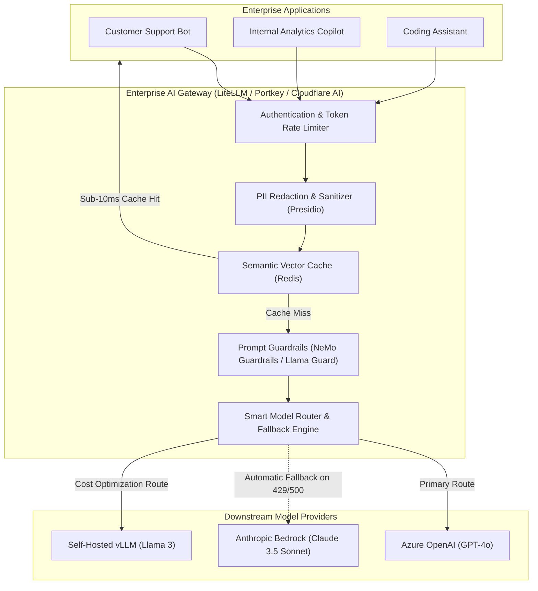
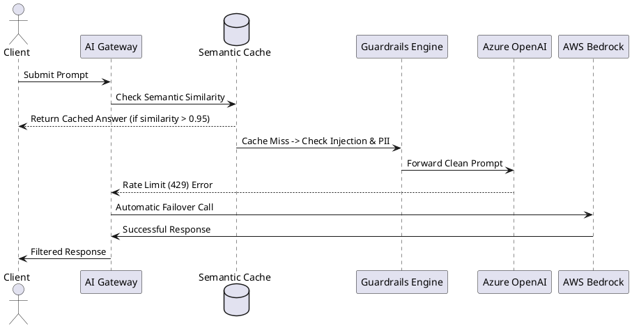

# Enterprise AI Gateway Architecture (LLM Proxy & Guardrails)

Centralized enterprise AI Gateway providing intelligent model routing, rate limiting, semantic caching, PII masking, and prompt guardrails.

## Mermaid Architecture Diagram

## PlantUML Specification

## Architectural Design Considerations

* **Semantic Caching**: Store prompt embeddings in Redis; if a incoming prompt is semantically identical (>95% cosine similarity) to an existing answer, return cached output instantly.
* **Provider Fallback**: Automatically failover to an alternative model provider (e.g., fallback from Azure OpenAI to AWS Bedrock) when HTTP 429 (rate limited) or 503 errors occur.
* **Cost & Token Tracking**: Record exact prompt and completion token counts per application team to enforce departmental chargebacks.

## Related Documentation & Patterns

* [Security: AI Security](file:///d:/company/products/enterprise-architecture-handbook/17-diagrams/security/ai-security.md)
* [Autonomous LLM Agent](file:///d:/company/products/enterprise-architecture-handbook/17-diagrams/ai/llm-agent-workflow.md)
* [RAG Architecture](file:///d:/company/products/enterprise-architecture-handbook/17-diagrams/ai/rag-architecture.md)
