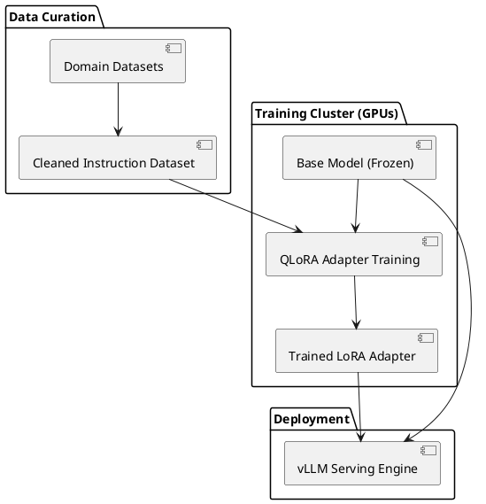

# Large Language Model Fine-Tuning Pipeline (LoRA / QLoRA)

Domain adaptation pipeline for open-weights models detailing data curation, parameter-efficient fine-tuning (PEFT/LoRA), evaluation, and quantizing for production inference.

## Mermaid Architecture Diagram

```mermaid
graph LR
    subgraph DataPrepTier ["1. Dataset Curation & Cleansing"]
        RawData["Domain Knowledge Corpus & Q&A Pairs"]
        Filter["Quality Filter & De-duplication"]
        Tokenizer["Model Tokenizer & Instruction Formatting"]
        RawData --> Filter
        Filter --> Tokenizer
    end

    subgraph TrainingTier ["2. Parameter-Efficient Fine-Tuning (PEFT)"]
        BaseModel["Base Open-Weights Model<br/>(Llama 3 70B / Mistral)"]
        QLoRA["QLoRA Engine (4-bit Base + FP16 Adapters)<br/>[Distributed GPU Cluster - DeepSpeed/FSDP]"]
        Adapters["Trained LoRA Adapter Weights<br/>(Size: ~100MB vs 140GB Base)"]

        Tokenizer --> QLoRA
        BaseModel --> QLoRA
        QLoRA --> Adapters
    end

    subgraph EvaluationTier ["3. Automated Model Evaluation"]
        Benchmark["Domain Benchmark Evaluation<br/>(MMLU, BLEU, HumanEval)"]
        Safety["Red-Teaming & Safety Guardrails"]
        Adapters --> Benchmark
        Benchmark --> Safety
    end

    subgraph ServingTier ["4. Optimized Production Inference"]
        Quantizer["Model Quantization (AWQ / GPTQ)"]
        vLLM["Inference Engine (vLLM / TensorRT-LLM)<br/>- PagedAttention<br/>- Continuous Batching"]
        Safety --> Quantizer
        Quantizer --> vLLM
    end
```

## PlantUML Specification

## Architectural Design Considerations

* **RAG vs Fine-Tuning**: Use RAG for retrieving dynamic factual knowledge; use Fine-Tuning for adapting style, formatting, domain jargon, or specialized reasoning patterns.
* **Parameter Efficiency**: LoRA/QLoRA trains <1% of model parameters, reducing GPU memory requirements from 8x H100s to a single workstation GPU.
* **Regression Testing**: Continuously evaluate fine-tuned models against standard general benchmarks to prevent 'catastrophic forgetting' of general capabilities.

## Related Documentation & Patterns

* [RAG Architecture](file:///d:/company/products/enterprise-architecture-handbook/17-diagrams/ai/rag-architecture.md)
* [Enterprise AI Gateway](file:///d:/company/products/enterprise-architecture-handbook/17-diagrams/ai/ai-gateway.md)
* [AI Review Checklist](file:///d:/company/products/enterprise-architecture-handbook/17-diagrams/ai/checklists.md)
