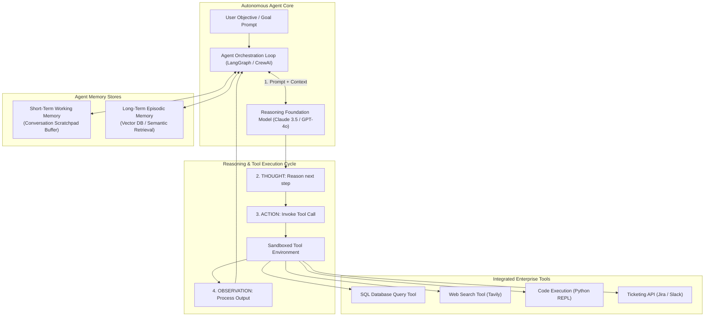
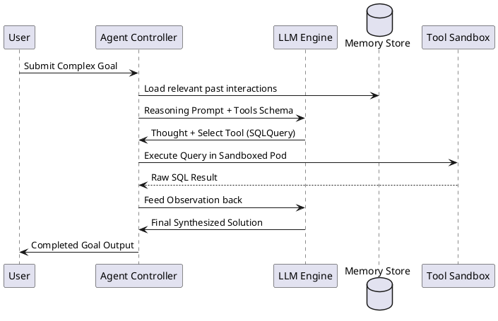

# Autonomous LLM Agent Architecture (ReAct & Tool Use)

Autonomous LLM agent workflow implementing the ReAct (Reasoning + Acting) loop, short/long-term memory stores, and sandboxed external tool execution.

## Mermaid Architecture Diagram

## PlantUML Specification

## Architectural Design Considerations

* **Bounded Execution Loops**: Always configure hard maximum iteration limits (e.g., max 10 loops) to prevent infinite reasoning recursion and runaway API costs.
* **Sandboxed Tool Execution**: Never execute LLM-generated code or shell commands directly on the host system; execute exclusively in ephemeral microVMs (Firecracker / gVisor).
* **Human-in-the-Loop (HITL)**: Require explicit human authorization before executing irreversible actions (e.g., sending external emails, updating financial databases).

## Related Documentation & Patterns

* [RAG Architecture](file:///d:/company/products/enterprise-architecture-handbook/17-diagrams/ai/rag-architecture.md)
* [AI Gateway](file:///d:/company/products/enterprise-architecture-handbook/17-diagrams/ai/ai-gateway.md)
* [Security: AI Security](file:///d:/company/products/enterprise-architecture-handbook/17-diagrams/security/ai-security.md)
