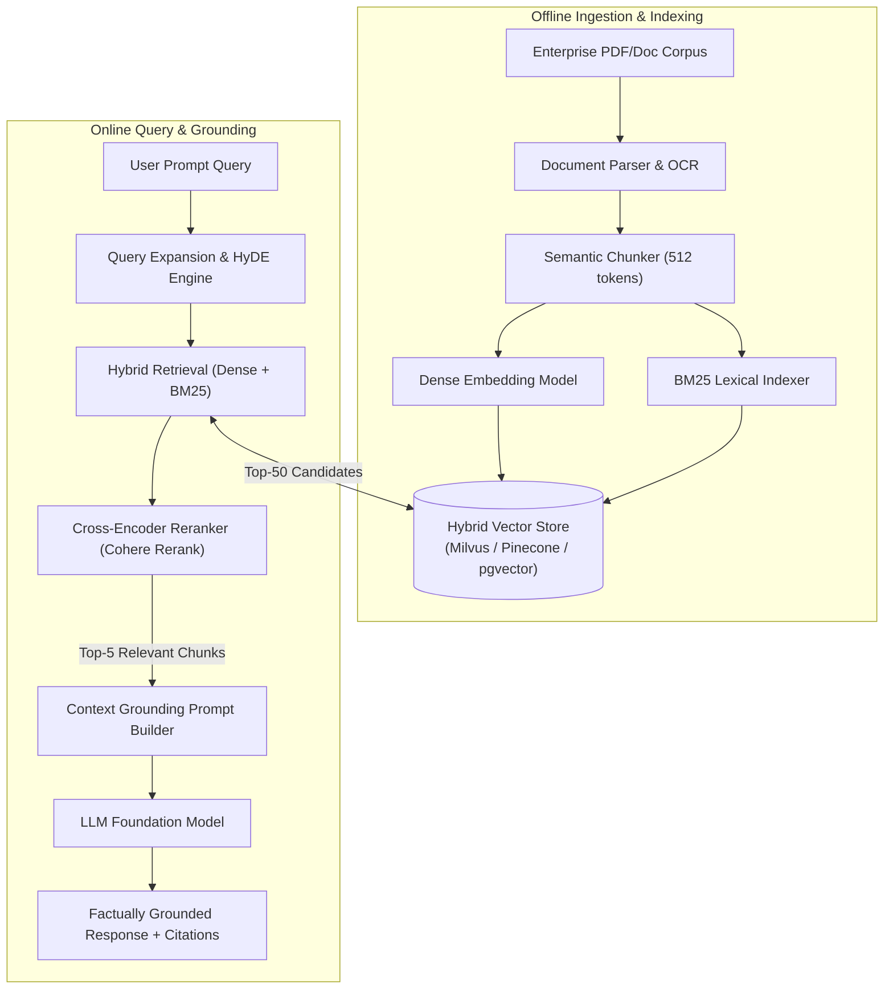
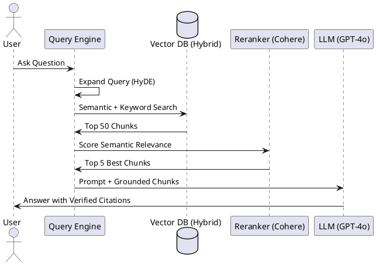

# Enterprise Retrieval-Augmented Generation (RAG) Architecture

Production-grade advanced RAG architecture featuring hybrid search (dense + sparse), reciprocal rank fusion (RRF), cross-encoder reranking, and citation grounding.

## Mermaid Architecture Diagram

## PlantUML Specification

## Architectural Design Considerations

* **Document-Level Security ACLs**: Embed user permissions directly in vector metadata; filter retrieval results based on requesting user identity.
* **Reranking Impact**: Cross-encoder rerankers dramatically improve answer accuracy by scoring the full interaction between the query and candidate passages.
* **Hallucination Detection**: Implement automated post-generation guardrails checking whether the generated claims are strictly supported by the retrieved context.

## Related Documentation & Patterns

* [Data-Flow: AI RAG Pipeline](file:///d:/company/products/enterprise-architecture-handbook/17-diagrams/data-flow/ai-rag-data-flow.md)
* [Autonomous LLM Agent](file:///d:/company/products/enterprise-architecture-handbook/17-diagrams/ai/llm-agent-workflow.md)
* [AI Gateway](file:///d:/company/products/enterprise-architecture-handbook/17-diagrams/ai/ai-gateway.md)
