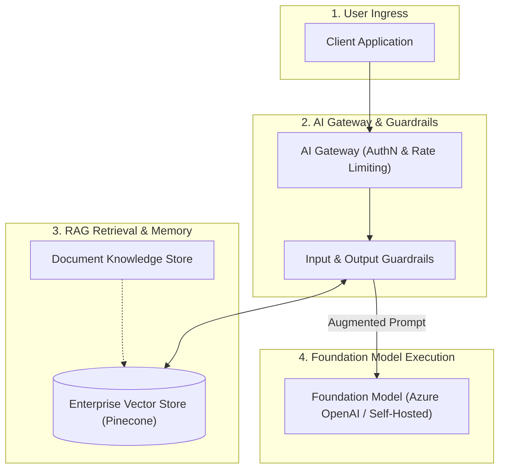
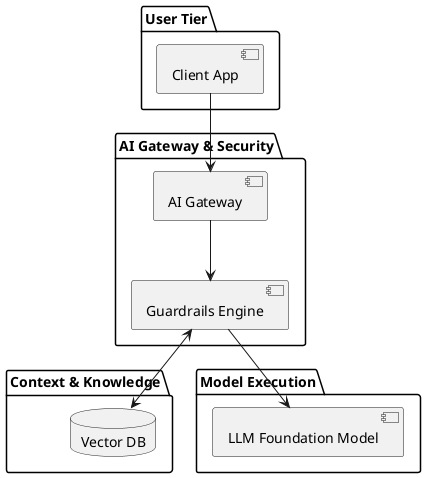

# AI Systems Architecture Blueprint Starter Template

Production-ready boilerplate template for modeling enterprise generative AI workloads, vector pipelines, foundation models, and guardrails.

## Mermaid Architecture Diagram

## PlantUML Specification

## Architectural Design Considerations

* **Standard Starter**: Copy and adapt this template when proposing new generative AI or LLM architectures.
* **Explicit Guardrails**: Always demarcate prompt guardrails between client applications and downstream foundation models.
* **Decoupled Context**: Treat enterprise context retrieval as an independent, secured tier.

## Related Documentation & Patterns

* [Enterprise AI Gateway](file:///d:/company/products/enterprise-architecture-handbook/17-diagrams/ai/ai-gateway.md)
* [RAG Architecture](file:///d:/company/products/enterprise-architecture-handbook/17-diagrams/ai/rag-architecture.md)
* [AI Review Checklist](file:///d:/company/products/enterprise-architecture-handbook/17-diagrams/ai/checklists.md)
