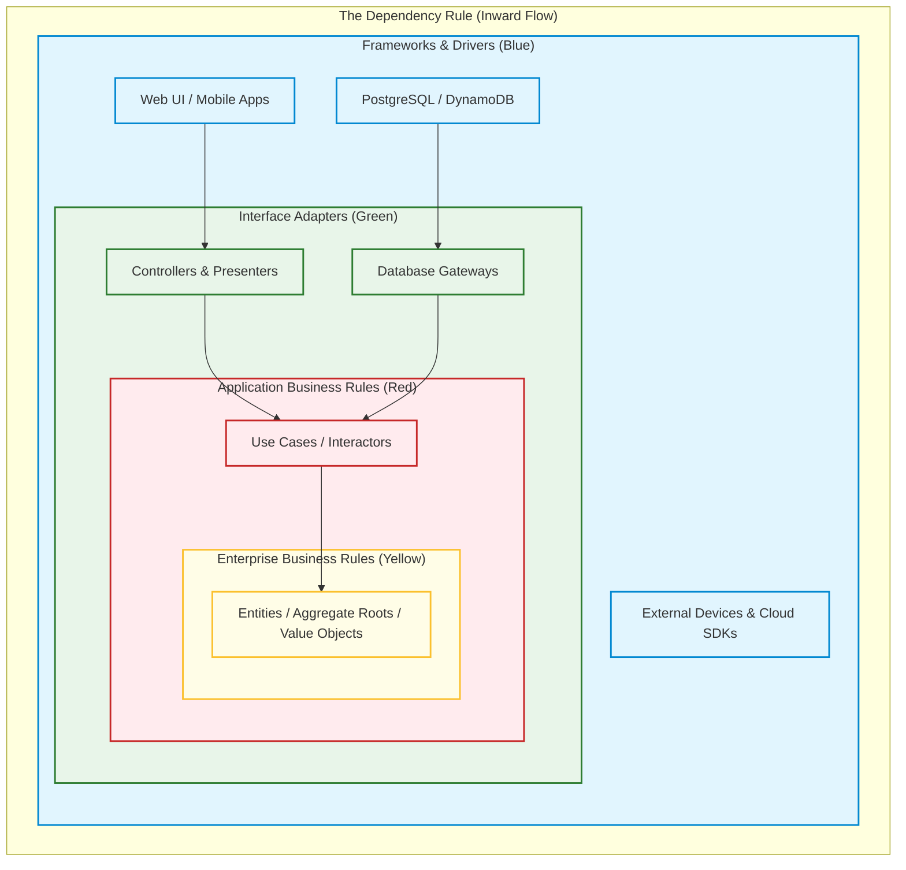
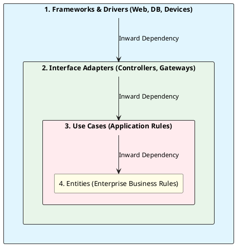

# Clean Architecture (Onion & Dependency Inversion)

Robert C. Martin's Clean Architecture concentric circles enforcing the fundamental Dependency Rule: source code dependencies must point inward.

## Mermaid Architecture Diagram

## PlantUML Specification

## Architectural Design Considerations

* **The Dependency Rule**: Nothing in an inner circle can know anything at all about something in an outer circle (no imports, no data formats).
* **Entities**: Encapsulate most general and high-level enterprise business rules; least likely to change when external factors change.
* **Use Cases**: Coordinate the flow of data to and from entities, executing user intents.

## Related Documentation & Patterns

* [Hexagonal Architecture](file:///d:/company/products/enterprise-architecture-handbook/17-diagrams/application/hexagonal.md)
* [Layered Architecture](file:///d:/company/products/enterprise-architecture-handbook/17-diagrams/application/layered.md)
* [Low-Level Design](file:///d:/company/products/enterprise-architecture-handbook/17-diagrams/architecture/low-level-design.md)
