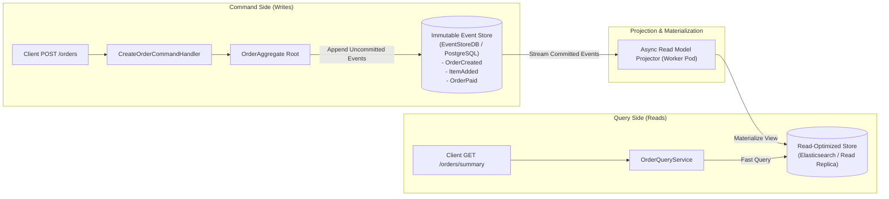
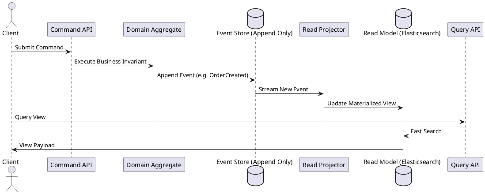

# CQRS and Event Sourcing (CQRS/ES) Architectural Model

Complete CQRS and Event Sourcing architecture detailing immutable event store journals, domain aggregates, projection workers, and read models.

## Mermaid Architecture Diagram

## PlantUML Specification

## Architectural Design Considerations

* **Complete Audit Trail**: The Event Store contains an immutable, complete history of every change that has ever occurred in the domain.
* **Temporal Replay**: Historical state can be replayed to regenerate broken read models or build brand-new projections retrospectively.
* **Eventual Consistency Window**: Clients must be architected to handle the brief latency between command commit and read model materialization.

## Related Documentation & Patterns

* [Event-Driven Application](file:///d:/company/products/enterprise-architecture-handbook/17-diagrams/application/event-driven.md)
* [Data-Flow: Event-Driven](file:///d:/company/products/enterprise-architecture-handbook/17-diagrams/data-flow/event-driven.md)
* [Hexagonal Architecture](file:///d:/company/products/enterprise-architecture-handbook/17-diagrams/application/hexagonal.md)
