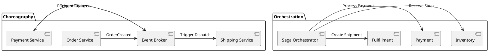

# Event-Driven Application Architecture (Choreography & Orchestration)

Decoupled event-driven application flow comparing event choreography across topic channels with centralized workflow orchestration engines.

## Mermaid Architecture Diagram

```mermaid
graph TD
    subgraph ChoreographyPattern ["Pattern 1: Event Choreography (Decentralized)"]
        SvcA["Order Service"]
        TopicA["Topic: orders.created"]
        SvcB["Payment Service"]
        TopicB["Topic: payments.settled"]
        SvcC["Shipping Service"]

        SvcA -->|"1. Publish"| TopicA
        TopicA -->|"2. Consume"| SvcB
        SvcB -->|"3. Publish"| TopicB
        TopicB -->|"4. Consume"| SvcC
    end

    subgraph OrchestrationPattern ["Pattern 2: Orchestration (Central Controller)"]
        SagaOrch["Order Saga Orchestrator<br/>(Temporal / AWS Step Functions)"]
        InvSvc["Inventory Service"]
        PaySvc["Payment Service"]
        ShipSvc["Shipping Service"]

        SagaOrch -->|"Command 1: Reserve Stock"| InvSvc
        InvSvc -->>|"Stock Reserved"| SagaOrch
        SagaOrch -->|"Command 2: Charge Card"| PaySvc
        PaySvc -->>|"Card Charged"| SagaOrch
        SagaOrch -->|"Command 3: Dispatch Package"| ShipSvc
    end
```

## PlantUML Specification



## Architectural Design Considerations

* **Choreography vs Orchestration**: Use choreography for simple, loosely coupled notifications; use orchestration when complex multi-step workflows require deterministic rollbacks.
* **Dead Lettering & Poison Messages**: Ensure all consumers route unparseable messages to dedicated Dead Letter Queues (DLQs) with alerting.
* **Schema Evolution**: Enforce backward and forward compatibility using schema registries (Avro/Protobuf) across all event topics.

## Related Documentation & Patterns

* [CQRS & Event Sourcing](file:///d:/company/products/enterprise-architecture-handbook/17-diagrams/application/cqrs-es.md)
* [Microservices](file:///d:/company/products/enterprise-architecture-handbook/17-diagrams/application/microservices.md)
* [Sequence: Saga Pattern](file:///d:/company/products/enterprise-architecture-handbook/17-diagrams/sequence/saga.md)
