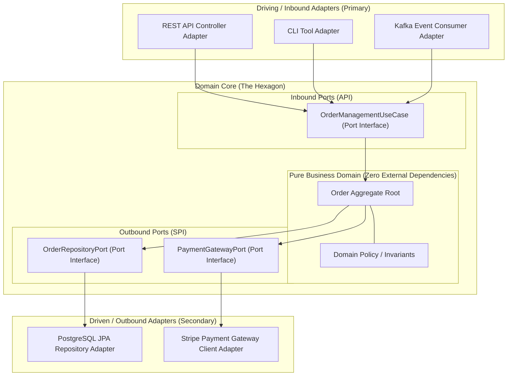
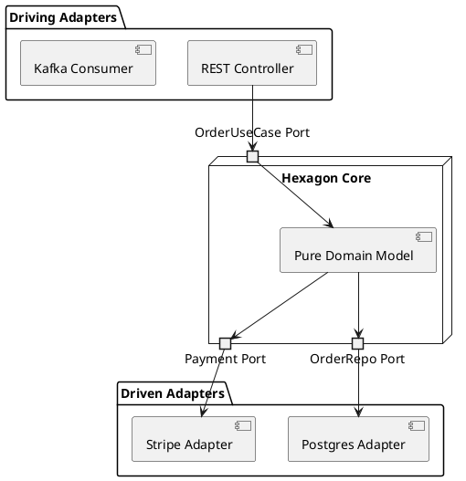

# Hexagonal Architecture (Ports and Adapters)

Alistair Cockburn's Ports and Adapters architecture isolating pure business domain logic from external drivers and driven infrastructure.

## Mermaid Architecture Diagram

## PlantUML Specification

## Architectural Design Considerations

* **Dependency Inversion**: The core domain defines interfaces (ports); infrastructure adapters implement them, pointing dependencies inward.
* **Technology Independence**: External libraries (Spring, JPA, AWS SDK) never leak into the domain core.
* **Testability Without Infrastructure**: The entire application core can be tested using in-memory mock adapters without spinning up databases or networks.

## Related Documentation & Patterns

* [Clean Architecture](file:///d:/company/products/enterprise-architecture-handbook/17-diagrams/application/clean.md)
* [Layered Architecture](file:///d:/company/products/enterprise-architecture-handbook/17-diagrams/application/layered.md)
* [Modular Monolith](file:///d:/company/products/enterprise-architecture-handbook/17-diagrams/application/modular-monolith.md)
