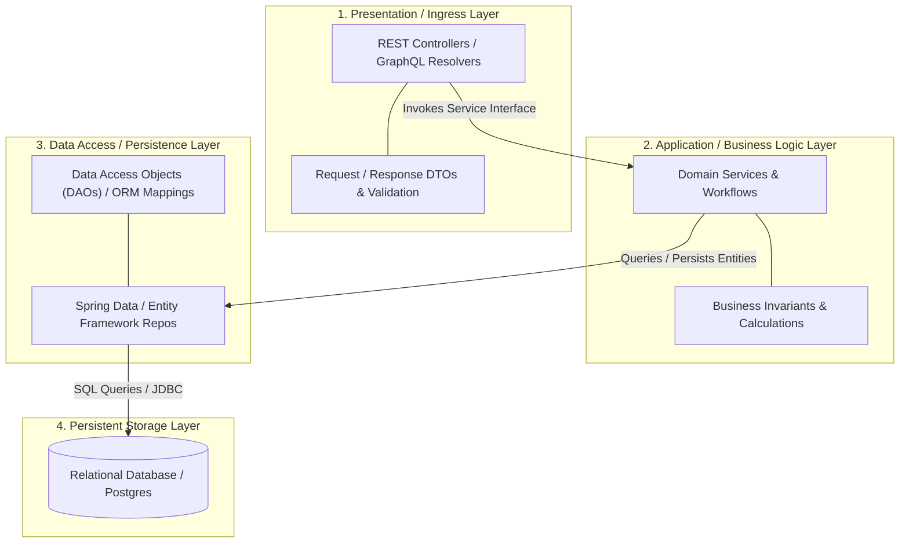
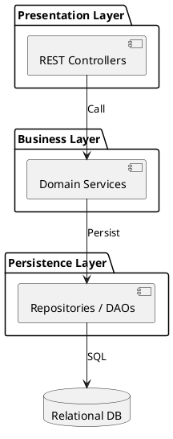

# Layered Architecture (N-Tier Structural Model)

Traditional enterprise layered architecture detailing strict separation of concerns across Presentation, Business Logic, Persistence, and Database tiers.

## Mermaid Architecture Diagram

## PlantUML Specification

## Architectural Design Considerations

* **Strict vs Relaxed Layering**: In strict layering, a layer can only call the layer immediately below it; relaxed layering permits calling deeper layers directly.
* **Leakage of Concerns**: Prevent persistence annotations and SQL semantics from leaking into presentation controllers.
* **Testing Simplicity**: Each layer can be mocked independently during unit and integration test suites.

## Related Documentation & Patterns

* [Clean Architecture](file:///d:/company/products/enterprise-architecture-handbook/17-diagrams/application/clean.md)
* [Hexagonal Architecture](file:///d:/company/products/enterprise-architecture-handbook/17-diagrams/application/hexagonal.md)
* [Modular Monolith](file:///d:/company/products/enterprise-architecture-handbook/17-diagrams/application/modular-monolith.md)
