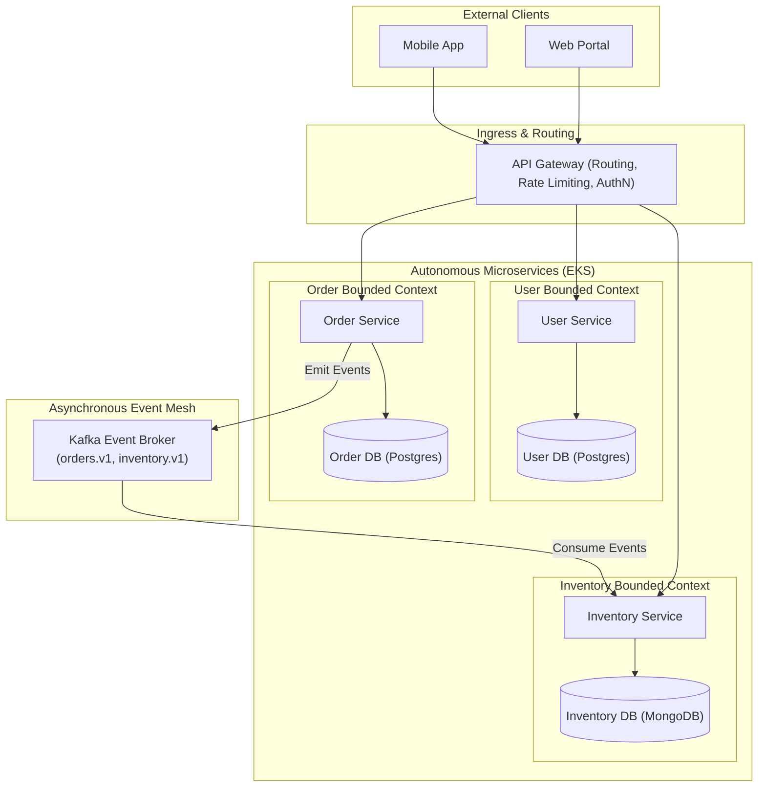
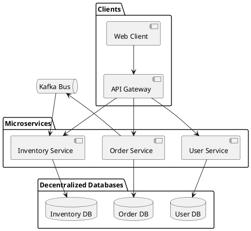

# Microservices Architecture & Decentralized Data

Autonomous, loosely coupled microservices architecture featuring independent deployability, decentralized data ownership, and API gateway composition.

## Mermaid Architecture Diagram

## PlantUML Specification

## Architectural Design Considerations

* **Database-per-Service**: Each microservice owns its private data store; direct cross-service database access is strictly prohibited.
* **Decoupled Deployments**: Any microservice can be built, tested, and deployed to production independently without synchronizing with other teams.
* **Distributed Governance**: Teams choose appropriate programming languages and database engines suited to their specific domain requirements.

## Related Documentation & Patterns

* [Modular Monolith](file:///d:/company/products/enterprise-architecture-handbook/17-diagrams/application/modular-monolith.md)
* [Event-Driven Application](file:///d:/company/products/enterprise-architecture-handbook/17-diagrams/application/event-driven.md)
* [C4 Container](file:///d:/company/products/enterprise-architecture-handbook/17-diagrams/c4/container.md)
