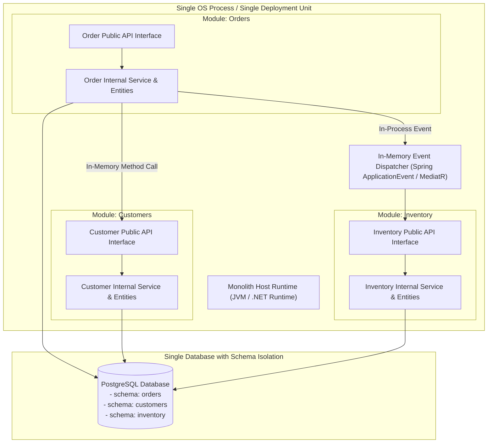
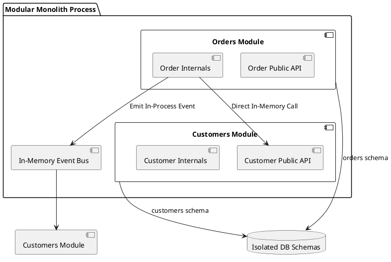

# Modular Monolith Architecture (In-Process Bounded Contexts)

Clean in-process modular monolith enforcing strict module boundaries, explicit public APIs, and zero out-of-process network latency.

## Mermaid Architecture Diagram

## PlantUML Specification

## Architectural Design Considerations

* **Zero Distributed System Overhead**: Eliminates network serialization, distributed transactions, and complex Kubernetes orchestration during early organizational stages.
* **Enforced Package Boundaries**: Leverage architectural unit tests (e.g., ArchUnit) to prevent Module A from importing internal classes of Module B.
* **Migration Stepping Stone**: A well-structured modular monolith can be decomposed into standalone microservices when team scale demands it.

## Related Documentation & Patterns

* [Microservices](file:///d:/company/products/enterprise-architecture-handbook/17-diagrams/application/microservices.md)
* [Layered Architecture](file:///d:/company/products/enterprise-architecture-handbook/17-diagrams/application/layered.md)
* [Hexagonal Architecture](file:///d:/company/products/enterprise-architecture-handbook/17-diagrams/application/hexagonal.md)
