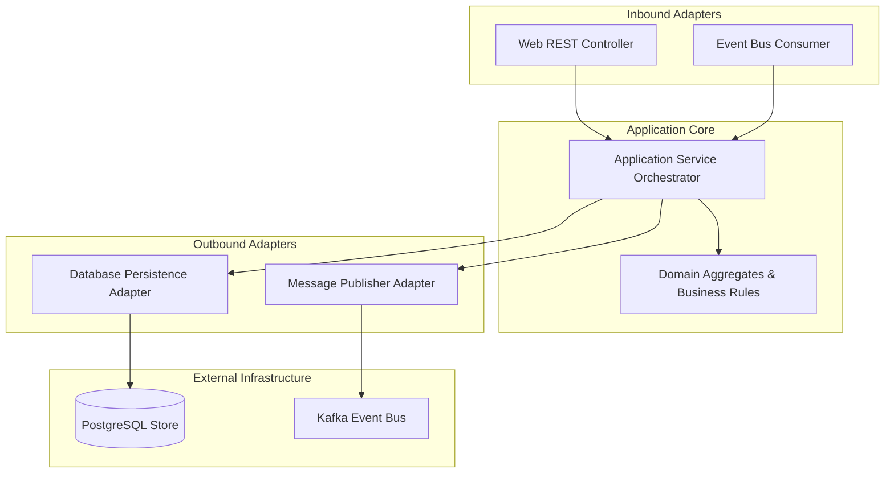
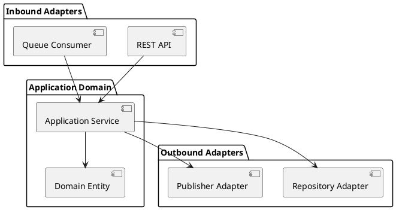

# Application Architecture Starter Template

Production-ready boilerplate template for modeling domain aggregates, application services, driving/driven adapters, and database connections.

## Mermaid Architecture Diagram

## PlantUML Specification

## Architectural Design Considerations

* **Standard Starter**: Use this template when documenting new microservices or bounded contexts.
* **Explicit Boundaries**: Separate adapters from pure business rules to maximize long-term maintainability.
* **Symmetrical Layout**: Inbound on top/left, core in center, outbound on bottom/right.

## Related Documentation & Patterns

* [Clean Architecture](file:///d:/company/products/enterprise-architecture-handbook/17-diagrams/application/clean.md)
* [Hexagonal Architecture](file:///d:/company/products/enterprise-architecture-handbook/17-diagrams/application/hexagonal.md)
* [Application Review Checklist](file:///d:/company/products/enterprise-architecture-handbook/17-diagrams/application/checklists.md)
