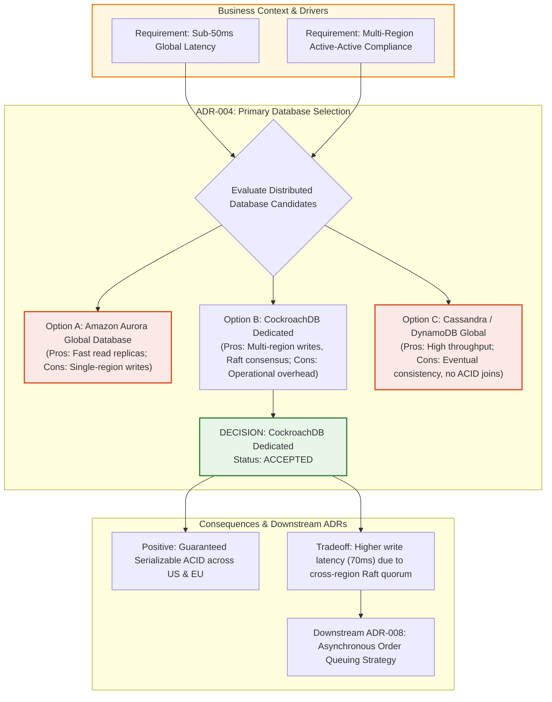
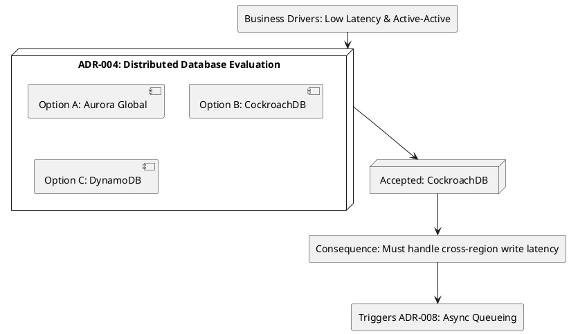

# Visual Architecture Decision Records (ADRs) & Trade-off DAG

Architectural decision topology modeling decision trees, context drivers, evaluated alternatives, chosen solutions, and downstream structural consequences.

## Mermaid Architecture Diagram

## PlantUML Specification

## Architectural Design Considerations

* **Explicit Trade-off Documentation**: Document not only why an architecture option was selected, but explicitly why alternative candidates were rejected.
* **Traceable Impact**: Link subsequent decisions to the consequences created by earlier ADRs.
* **Versioned in Repository**: Store ADR Markdown files in Git (`docs/adrs/`) and review them via formal pull request discussions.

## Related Documentation & Patterns

* [Trade-off Matrix](file:///d:/company/products/enterprise-architecture-handbook/17-diagrams/architecture/tradeoff-matrix.md)
* [System Architecture Document](file:///d:/company/products/enterprise-architecture-handbook/17-diagrams/architecture/system-architecture-document.md)
* [Architecture Review Checklist](file:///d:/company/products/enterprise-architecture-handbook/17-diagrams/architecture/checklists.md)
