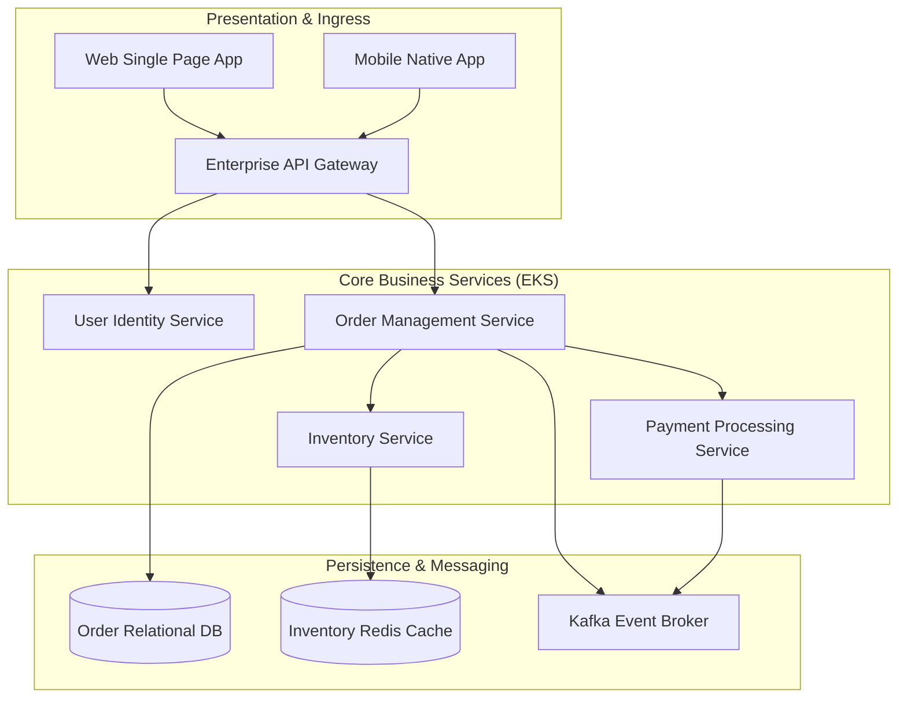
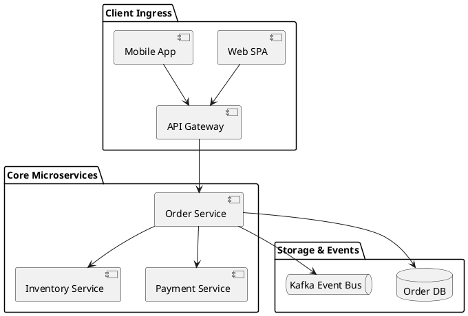

# High-Level Design (HLD) Architecture Blueprint

High-Level Design topology capturing system boundaries, external interfaces, component responsibilities, and primary data stores.

## Mermaid Architecture Diagram

## PlantUML Specification

## Architectural Design Considerations

* **Scope Definition**: HLD establishes subsystem boundaries, integration protocols, and operational domains without over-specifying internal code classes.
* **Cross-Cutting Concerns**: Explicitly define telemetry, security, and exception handling strategies across all depicted services.
* **Component Sizing**: Include estimated transaction per second (TPS) and storage sizing metrics directly on subsystem interfaces.

## Related Documentation & Patterns

* [Low-Level Design](file:///d:/company/products/enterprise-architecture-handbook/17-diagrams/architecture/low-level-design.md)
* [System Architecture Document](file:///d:/company/products/enterprise-architecture-handbook/17-diagrams/architecture/system-architecture-document.md)
* [C4 Container](file:///d:/company/products/enterprise-architecture-handbook/17-diagrams/c4/container.md)
