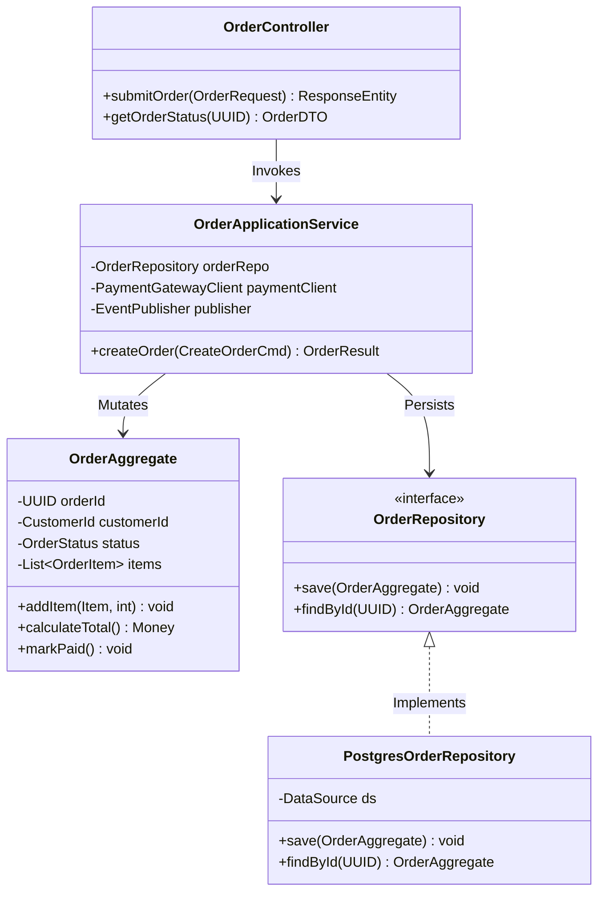
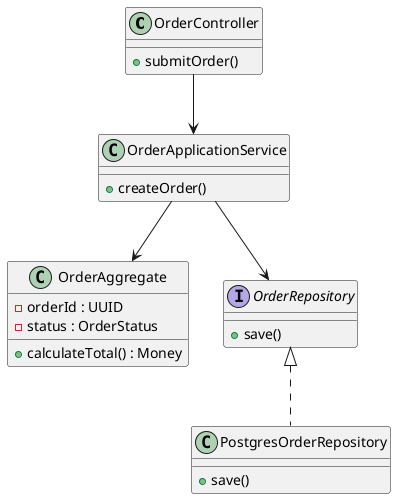

# Low-Level Design (LLD) & Component Execution Model

Detailed component-level design capturing class structures, design patterns, internal thread execution models, and transactional boundaries.

## Mermaid Architecture Diagram

## PlantUML Specification

## Architectural Design Considerations

* **Tactical DDD Alignment**: Ensure aggregate roots enforce domain invariants internally before state persistence.
* **Interface Segregation**: Cleanly separate application service interfaces from database infrastructure adapters (Hexagonal Architecture).
* **Concurrency & Locking**: Explicitly document optimistic locking (`version` column) or pessimistic locking strategies on domain entities.

## Related Documentation & Patterns

* [High-Level Design](file:///d:/company/products/enterprise-architecture-handbook/17-diagrams/architecture/high-level-design.md)
* [Application: Clean Architecture](file:///d:/company/products/enterprise-architecture-handbook/17-diagrams/application/clean.md)
* [C4 Component](file:///d:/company/products/enterprise-architecture-handbook/17-diagrams/c4/component.md)
