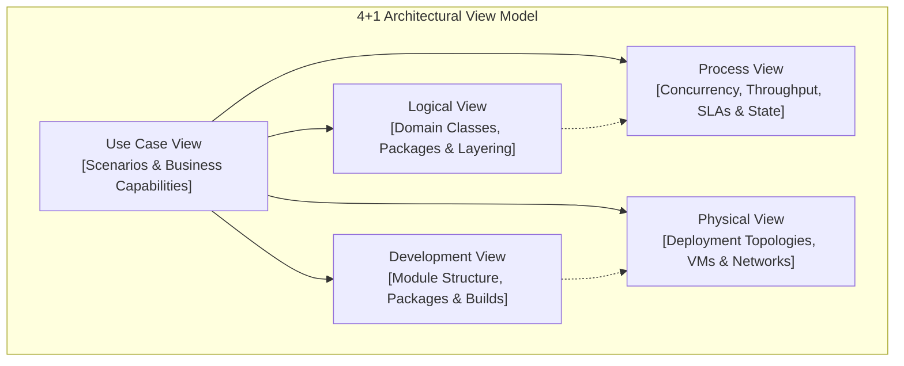
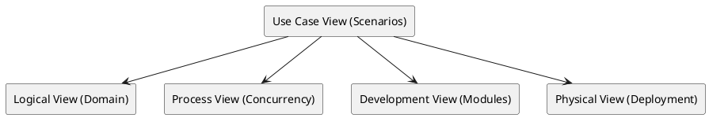

# System Architecture Document (SAD) Master Blueprint

Comprehensive enterprise architectural blueprint covering 4+1 architectural views (Logical, Process, Development, Physical, and Scenarios/Use Cases).

## Mermaid Architecture Diagram

## PlantUML Specification

## Architectural Design Considerations

* **Stakeholder Alignment**: Each view addresses a distinct stakeholder persona (business sponsors, software engineers, DevOps, operations).
* **Traceability**: All architectural elements in the logical and physical views must trace back to concrete business requirements in the Use Case view.
* **Living Document**: The SAD must be updated incrementally via pull requests with each major release milestone.

## Related Documentation & Patterns

* [High-Level Design](file:///d:/company/products/enterprise-architecture-handbook/17-diagrams/architecture/high-level-design.md)
* [Trade-off Matrix](file:///d:/company/products/enterprise-architecture-handbook/17-diagrams/architecture/tradeoff-matrix.md)
* [Diagramming Standard](file:///d:/company/products/enterprise-architecture-handbook/17-diagrams/diagramming-standard.md)
