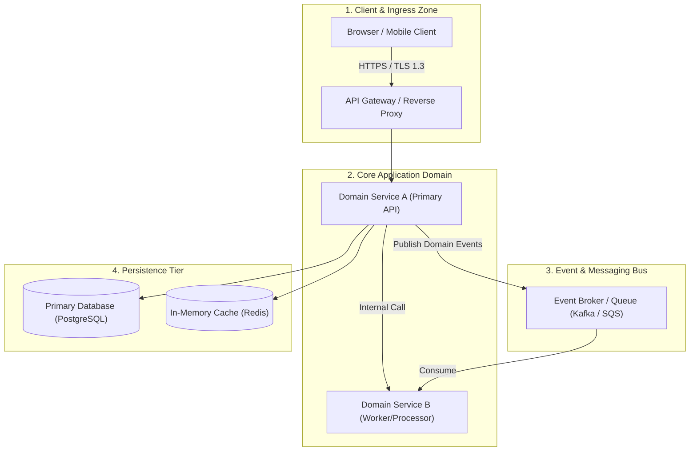
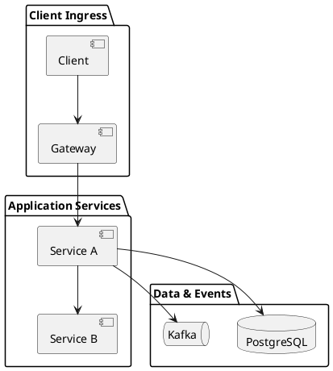

# Architecture Blueprint Starter Template

Standardized enterprise architecture blueprint starter template covering ingress, application services, messaging integration, and storage.

## Mermaid Architecture Diagram

## PlantUML Specification

## Architectural Design Considerations

* **Reusable Baseline**: Copy and adapt this template when beginning new high-level architectural proposals.
* **Distinct Tiers**: Maintain clear separation between presentation, application logic, messaging, and persistence tiers.
* **Explicit Flow Direction**: Enforce top-to-bottom or left-to-right flow directionality for visual consistency.

## Related Documentation & Patterns

* [High-Level Design](file:///d:/company/products/enterprise-architecture-handbook/17-diagrams/architecture/high-level-design.md)
* [Diagramming Standard](file:///d:/company/products/enterprise-architecture-handbook/17-diagrams/diagramming-standard.md)
* [Architecture Review Checklist](file:///d:/company/products/enterprise-architecture-handbook/17-diagrams/architecture/checklists.md)
