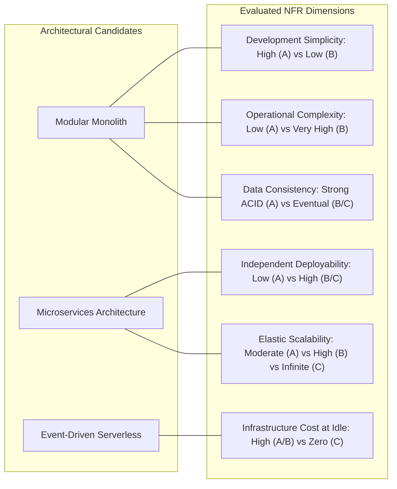
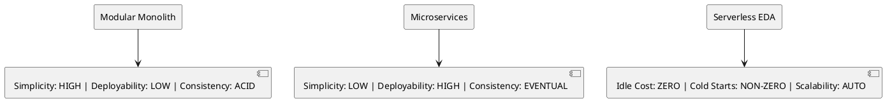

# Architectural Trade-Off Visual Analysis (Spider & Radar Maps)

Multi-dimensional architectural trade-off framework comparing architectural styles across Non-Functional Requirements (NFRs).

## Mermaid Architecture Diagram

## PlantUML Specification

## Architectural Design Considerations

* **No Free Lunch**: Every architectural decision involves trading one set of problems for another (e.g., trading monolithic deployment bottlenecks for distributed system network failures).
* **Context Over Hype**: Choose architectural patterns suited to current organization scale and team cognitive load rather than aspirational hyperscale architectures.
* **Quantifiable Scoring**: Score competing patterns across 1-5 scales against explicit project architectural quality attributes.

## Related Documentation & Patterns

* [ADRs Visualized](file:///d:/company/products/enterprise-architecture-handbook/17-diagrams/architecture/adrs-visualized.md)
* [High-Level Design](file:///d:/company/products/enterprise-architecture-handbook/17-diagrams/architecture/high-level-design.md)
* [Diagram Selection Guide](file:///d:/company/products/enterprise-architecture-handbook/17-diagrams/diagram-selection-guide.md)
