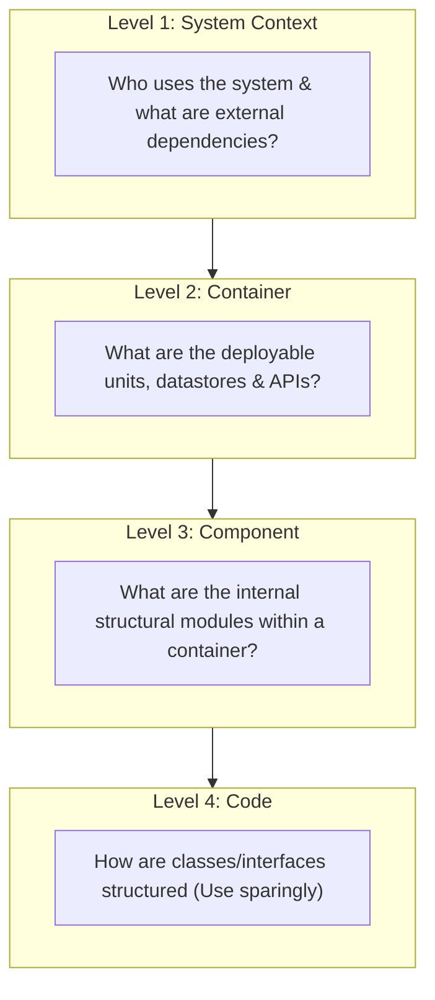

# C4 Architecture Modeling Library

The **C4 Model** (Context, Container, Component, Code) created by Simon Brown provides a hierarchical, zoomable visual framework for communicating software architecture at different levels of abstraction.

---

## C4 Model Files in This Library

1. [**System Context (`context.md`)**](./context.md) — High-level enterprise context, human personas, external software systems.
2. [**Container Diagram (`container.md`)**](./container.md) — Runtimes, databases, queues, frontend SPAs, API gateways.
3. [**Component Diagram (`component.md`)**](./component.md) — Internal architectural modules, controllers, repositories, event listeners.
4. [**Code Diagram (`code.md`)**](./code.md) — Class and interface modeling; justification and guidelines for when to avoid.
5. [**System Landscape (`system-landscape.md`)**](./system-landscape.md) — Cross-system enterprise relationship mapping.
6. [**Dynamic Diagram (`dynamic.md`)**](./dynamic.md) — Tracing runtime request flows and messaging across containers.
7. [**C4 Deployment (`deployment.md`)**](./deployment.md) — Mapping containers to physical/cloud infrastructure nodes.
8. [**Context Template (`context-template.md`)**](./context-template.md) — Copy-pasteable starter template in Mermaid and PlantUML.
9. [**Container Template (`container-template.md`)**](./container-template.md) — Copy-pasteable container starter template.
10. [**Component Template (`component-template.md`)**](./component-template.md) — Copy-pasteable component starter template.
11. [**Enterprise Example (`enterprise-example.md`)**](./enterprise-example.md) — End-to-end multi-tier Digital Banking architecture progression.
12. [**C4 Review Checklists (`checklists.md`)**](./checklists.md) — Specific review rubric for C4 models.

---

## Detailed Guides
- [C4 Model Guidelines & Best Practices](./c4-model-guidelines.md)
- [C4 Overview](./c4-overview.md)
- [Context Diagram Guide](./context-diagram.md)
- [Container Diagram Guide](./container-diagram.md)
- [Component Diagram Guide](./component-diagram.md)
- [Code Diagram Guide](./code-diagram.md)
