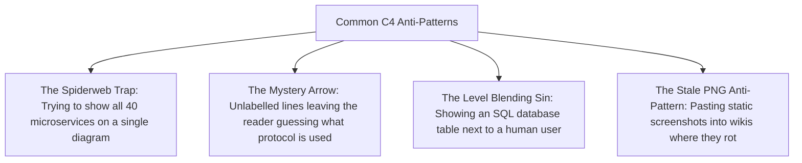

# C4 Model Guidelines & Best Practices

## Overview

A software architecture diagram is only valuable if it communicates unambiguous intent across technical and non-technical stakeholders. Inconsistent notations, missing technology tags, mystery acronyms, and ambiguous line connections turn architectural documentation into useless noise.

This guide establishes the mandatory authoring standards, visual conventions, and anti-patterns for creating production-grade C4 model diagrams across enterprise initiatives.

---

## The 10 Commandments of C4 Diagramming

1. **Every Diagram Must Have a Title**: State the diagram type, scope, and system name (e.g., `[System Context] Internet Banking System`, `[Container] Order Fulfillment Platform`).
2. **Every Box Must Have a Name, Technology, and Responsibility**: Never draw a blank box or a box that only says `"API"`.
   - *Bad*: `[Service]`
   - *Good*: `Order Service [Container: Java / Spring Boot]` + `Processes customer orders and initiates billing`.
3. **Every Arrow Must Have a Label and Protocol**: Never draw an unlabelled arrow or an arrow that just says `"uses"`.
   - *Bad*: `Client ---> API`
   - *Good*: `Client --->|Submits checkout requests via [JSON/HTTPS]| API`
4. **Arrows Must Follow the Direction of Dependency / Data Flow**: Lines should be unidirectional, pointing in the direction of the request or invocation. If a protocol is bidirectional (WebSockets), explicitly label it `[Full-Duplex WebSocket]`.
5. **Standardize Visual Color Coding**:
   - **Internal / In-Scope Systems**: Primary blue / navy (`#1168bd`).
   - **External / Out-of-Scope Systems**: Neutral grey (`#999999`).
   - **People / Users**: Bright accent / cyan (`#08427b`).
   - **Databases / Storage**: Cylinder shape or distinct dark tint.
6. **Include an Explicit Legend / Key**: Every diagram must include a visual legend explaining colors, line styles (dashed vs solid), and shapes.
7. **Containers Are NOT Just Docker**: In C4, a container is any deployable runtime unit (web browser app, mobile app, relational database, serverless function, message queue).
8. **Keep Layouts Flat and Scannable**: Avoid tangled webs of criss-crossing lines. Arrange components hierarchically: Clients at top $\rightarrow$ Gateways $\rightarrow$ Services $\rightarrow$ Databases at bottom.
9. **Avoid Level Mixing**: Never put a Level 3 component (e.g., an internal Java service class) inside a Level 1 System Context diagram. Keep levels of abstraction strictly separated.
10. **Treat Diagrams as Code**: Store diagram definitions as text (Mermaid, PlantUML, Structurizr DSL) directly inside Git repositories alongside the application source code.

---

## Diagram Syntax Standards: Mermaid vs. Structurizr

### 1. Mermaid (Native GitHub / Markdown Rendering)
Mermaid is the recommended standard for lightweight documentation embedded directly in Git READMEs and markdown knowledge bases:

```markdown
```mermaid
flowchart TD
    User["Customer [Person]<br/>Retail banking user"]
    System["Banking System [Software System]<br/>Provides banking features"]
    User -->|Views balances using [HTTPS]| System
```
```

### 2. Structurizr DSL (The Industrial Enterprise Standard)
For large enterprise architecture repositories, Simon Brown's **Structurizr DSL** allows architects to define a single underlying architectural model in text and automatically render Context, Container, Component, and Deployment views without duplicating code:

```text
workspace "Internet Banking" "Enterprise Architecture Model" {
    model {
        customer = person "Personal Banking Customer" "A retail customer of the bank."
        bankingSystem = softwareSystem "Internet Banking System" "Allows customers to view balances."
        customer -> bankingSystem "Uses" "HTTPS"
    }
    views {
        systemContext bankingSystem "Context" {
            include *
            autoLayout
        }
    }
}
```

---

## Common C4 Anti-Patterns to Avoid


