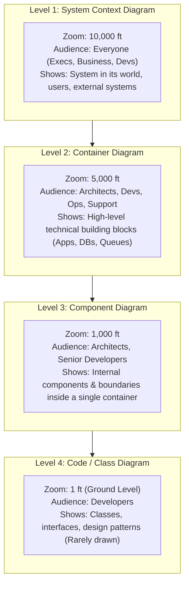

# The C4 Model for Software Architecture: Overview

## Overview

The C4 Model—created by software architect Simon Brown—is an intuitive, hierarchical "Google Maps" approach to software architecture visualization. Before the C4 model, software architecture diagrams suffered from severe ambiguity: inconsistent box-and-arrow notations, confusing acronyms, mixed levels of abstraction, and undefined line connections.

The C4 model standardizes architectural diagramming into **four distinct levels of zoom**, each targeted at different stakeholder audiences with precise levels of technical detail.

---

## The Four Levels of Zoom

---

## The C4 Mental Model: Maps Analogy

| C4 Level | Maps Equivalent | What It Explains | Primary Stakeholder |
|:---|:---|:---|:---|
| **1. System Context** | Country / Continental Map | How does our system fit into the broader enterprise and third-party world? | CIO, Product Managers, Business Stakeholders |
| **2. Container** | City / Metro Transit Map | What are the deployable software units (APIs, web apps, databases)? | Architects, Engineers, SRE / DevOps |
| **3. Component** | Neighborhood / Street Map | How is a single application service internally modularized? | Tech Leads, Software Developers |
| **4. Code** | Architectural House Floorplan | How is a specific class or interface implemented? | Developers (usually generated via IDE/UML) |

---

## Core Principles of C4 Diagramming

1. **Every Box Must Have**:
   - A **Name** (e.g., `Order Processing Service`).
   - An explicit **Type / Technology Tag** in brackets (e.g., `[Container: Java / Spring Boot]` or `[Software System]`).
   - A concise **1-2 sentence description** of its core responsibility (e.g., `Manages customer order states, reservations, and payment initiation`).
2. **Every Relationship (Arrow) Must Have**:
   - An explicit **Action Verb** (e.g., `Sends payment requests to`).
   - The underlying **Protocol / Format** in brackets (e.g., `[HTTPS / REST / JSON]` or `[gRPC / Protobuf]`).
   - Strict arrow directionality (pointing in the direction of dependency / invocation).
3. **Containers are Deployable Units**: In C4 terminology, a "Container" is **NOT** specifically a Docker container; it is any independently running, deployable software unit (a mobile app, an SPA web app, a relational database, a serverless function, or a message broker).
