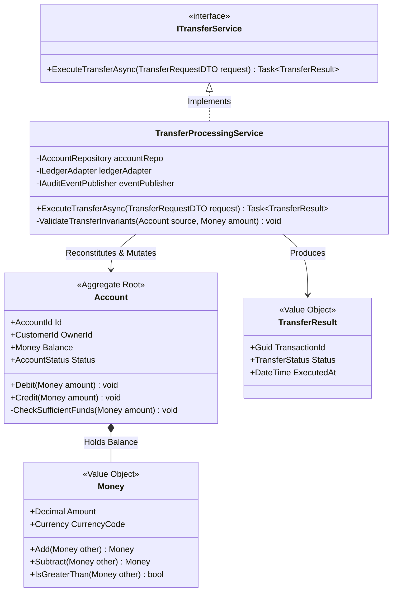

# C4 Model: Level 4 — Code / Class Diagram

## Overview

A **Code Diagram (Level 4)** zooms directly into an individual **Component** from Level 3 to show how it is implemented in actual code. It typically takes the form of a UML Class Diagram or Entity-Relationship diagram, illustrating classes, interfaces, inheritance hierarchies, design patterns, and method signatures.

> [!WARNING]
> **Simon Brown's Golden Rule on Level 4**:
> **"Level 4 is an optional level of detail. You should rarely, if ever, draw Level 4 diagrams manually."**

---

## When to Use Level 4 Diagrams

In 95% of enterprise software initiatives, Level 4 diagrams should **NOT** be manually drawn or maintained because:
- Code changes daily during active sprints; manually maintained class diagrams become obsolete within 48 hours.
- Modern IDEs (IntelliJ IDEA, Visual Studio) and tools (PlantUML, Mermaid) can generate class diagrams on demand directly from source code.

### Legitimate Exceptions: When Level 4 IS Justified
1. **Complex Algorithmic Design**: When explaining a sophisticated distributed consensus algorithm (e.g., Raft state machine) or a high-concurrency memory queue.
2. **Core Architectural Patterns**: When educating a development team on how to implement an abstract architectural pattern (e.g., Abstract Factory, Decorator, or Domain Aggregate Root).
3. **Regulatory / Safety-Critical Auditing**: In medical devices, aviation, or nuclear systems where formal design documentation is legally mandated prior to code compilation.

---

## Production Enterprise Example: Transfer Processing Service Class Diagram

Below is a Level 4 UML diagram illustrating how the `Transfer Processing Service` component from Level 3 implements the Domain Aggregate and Factory patterns:

---

## Modern Alternatives to Manual Level 4 Diagramming

Instead of drawing Level 4 diagrams by hand in Visio or draw.io:
1. **Generate via Compiler Reflection**: Use tools like `javadoc`, `doxygen`, or Roslyn code analyzers to render class relationships on demand during CI builds.
2. **Document via Executable Unit Tests**: A well-structured BDD test suite (Cucumber, SpecFlow) serves as executable, living documentation that is guaranteed never to go out of date.
3. **Use Code Comments & Markdown ADRs**: Explain complex class interactions directly alongside the code in markdown files within the repository.
