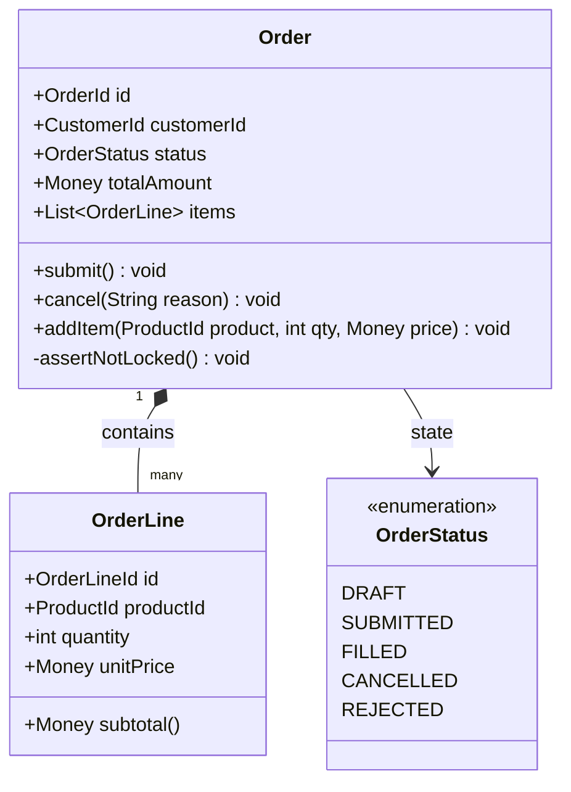

# C4 Level 4: Code Diagram

The **Code Diagram** models the lowest level of abstraction, illustrating classes, interfaces, design patterns, and entity relationships.

## Architectural Guidance: When to Use vs When to Avoid

> [!WARNING]
> **Code diagrams date rapidly and carry extreme maintenance overhead.** In 95% of enterprise software projects, Level 4 diagrams should NOT be manually drawn or maintained.

### When Code Diagrams are Justified
1. **Core Domain Model Primitives**: Complex Domain-Driven Design (DDD) aggregate roots, entities, and value objects where business invariants are critical.
2. **Complex Concurrency State Machines**: Order settlement states, cryptographic handshake protocols, or distributed consensus state machines.
3. **Framework / SDK Design**: Architectural specifications for reusable internal developer platform (IDP) libraries or middleware SDKs.

### When to Avoid
- Routine CRUD controllers, typical data transfer objects (DTOs), or simple Spring/Express endpoints.
- Auto-generate using IDE tooling or reflections if an auditor specifically requests class models.

---

## Example: DDD Aggregate Root Class Diagram (Mermaid)

