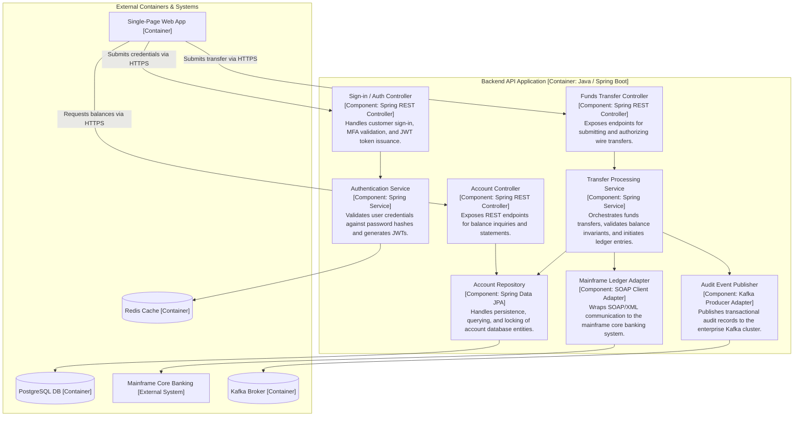

# C4 Model: Level 3 — Component Diagram

## Overview

A **Component Diagram (Level 3)** zooms inside a single **Container** identified in Level 2 to illustrate its internal structural composition. It decomposes the container into its primary **Components**—groupings of related functionality encapsulated behind well-defined interfaces—and shows their interactions, dependencies, and connections to external containers.

This diagram is targeted specifically at software engineers and tech leads. It serves as an architectural blueprint for structuring the codebase, enforcing layer boundaries, and establishing dependency injection relationships.

---

## What is a "Component" in the C4 Model?

> In the C4 model, a **Component** is defined as **a grouping of related functionality encapsulated behind a clean interface, executing within the runtime environment of a single container**.

In modern object-oriented and modular architectures, components typically map to:
- **Controllers / Endpoints**: HTTP request handlers and input validators.
- **Application Services / Use Cases**: Business workflow orchestrators.
- **Domain Services & Entities**: Core business rule executors.
- **Repositories & Adapters**: Data access layers and external client facades.

---

## Production Enterprise Example: Backend API Application Components

Below is the Level 3 decomposition of the `Backend API Application [Container: Java / Spring Boot]` from the Level 2 Banking system:

---

## Authoring Guidelines for Level 3

1. **Keep it High-Level**: Do not diagram every single helper class, utility function, or DTO. Diagram only significant architectural components (e.g., Controllers, Domain Services, Repositories, Adapters).
2. **One Diagram Per Container**: Do not attempt to fit components from multiple containers into a single Level 3 diagram. If you have 5 containers, you have 5 potential Level 3 diagrams.
3. **Only Diagram Significant Containers**: Do not waste time drawing Level 3 diagrams for simple CRUD containers or third-party off-the-shelf software. Focus strictly on complex, mission-critical containers with rich business logic.
4. **Enforce Dependency Inversion**: Verify that presentation controllers depend on service interfaces, and services depend on repository abstractions rather than directly on concrete database drivers.
