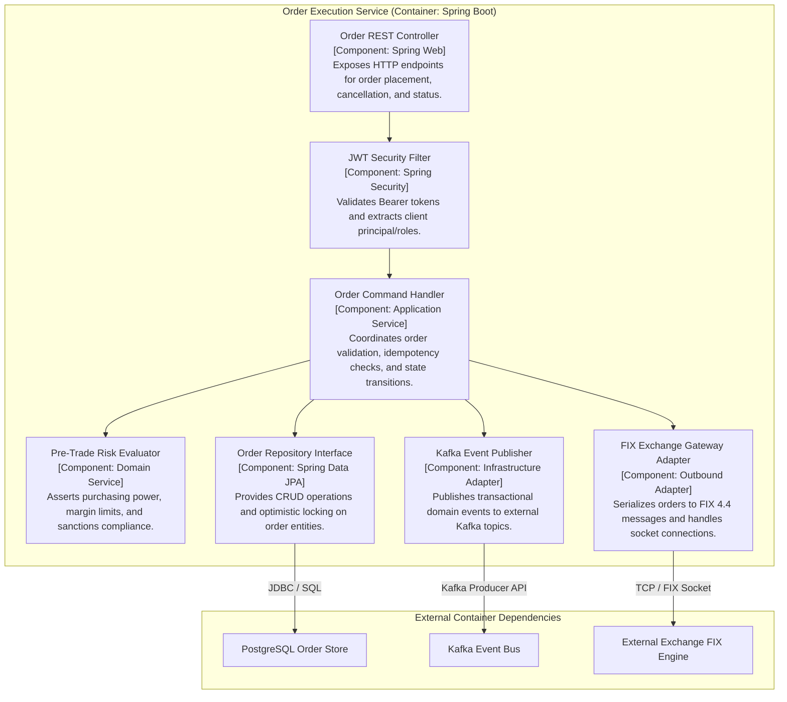

# C4 Level 3: Component Diagram

The **Component Diagram** decomposes an individual container into its internal structural components (modules, controllers, service handlers, repository interfaces, adapters) and illustrates their dependencies.

## When to Use
- Detailed Technical Design Documents (TDDs) and team sprint planning.
- Enforcing Clean Architecture, Hexagonal (Ports & Adapters), or Modular Monolith boundaries.
- Refactoring complex services with high cyclomatic complexity.

---

## Architecture Example: Order Execution Service Components

---

## Related References
- [Component Template](./component-template.md)
- [Application Architecture Diagrams](../application/README.md)
