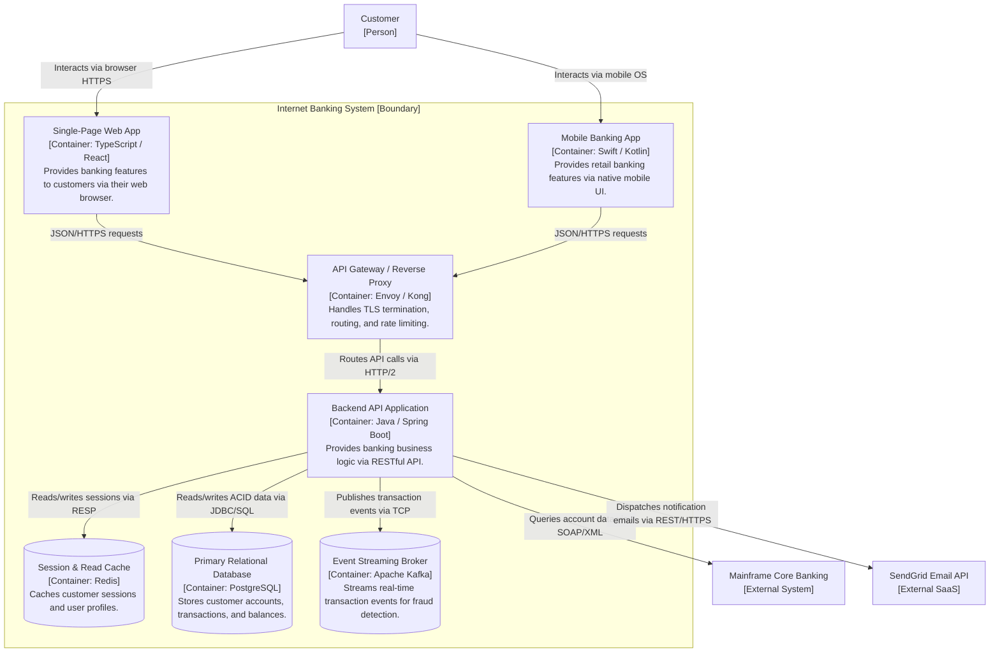

# C4 Model: Level 2 — Container Diagram

## Overview

A **Container Diagram (Level 2)** zooms inside the central software system boundary established in Level 1. It illustrates the high-level technical architecture by showing the deployable and runnable software units—known as **Containers**—that compose the system, along with how they communicate and where data is stored.

This diagram is the most frequently authored and reviewed artifact in Solution Architecture. It provides software engineers, architects, DevOps, and operations teams with a clear roadmap of system responsibilities, technical stacks, and integration protocols.

---

## What is a "Container" in the C4 Model?

> [!IMPORTANT]
> In the C4 model, a **"Container" is NOT synonymous with a Docker container**. 
> A Container is defined as **any independently deployable or runnable software artifact or data store that executes code or holds data**.

### Examples of C4 Containers
- **Client Applications**: Single-Page Applications (React, Angular), Mobile Apps (iOS/Android), CLI tools.
- **Server Applications**: REST API applications (Spring Boot, ASP.NET Core), background worker daemons, serverless functions (AWS Lambda).
- **Data Stores**: Relational databases (PostgreSQL), NoSQL stores (DynamoDB, MongoDB), in-memory caches (Redis).
- **Messaging Infrastructure**: Event streaming clusters (Apache Kafka), message brokers (RabbitMQ).
- **File & Object Storage**: S3 buckets, network-attached storage (NAS).

---

## Production Enterprise Example: Internet Banking System Containers

---

## Authoring Guidelines for Level 2

1. **Explicit Technologies**: Every container box must explicitly declare its technology runtime in brackets (e.g., `[Container: Go / Gin]`, `[Container: Redis 7.2]`).
2. **Responsibilities over Descriptions**: State clearly what the container does, not how it works internally (e.g., `Handles payment authorizations and idempotency verification`).
3. **Specify Communication Protocols**: Every connection arrow must identify the transport protocol and serialization format (e.g., `JSON/HTTPS`, `gRPC/HTTP/2`, `JDBC/TCP`, `AMQP`).
4. **Boundary Isolation**: Group internal containers inside a clear visual boundary box representing the software system, leaving external third-party systems outside the perimeter.
