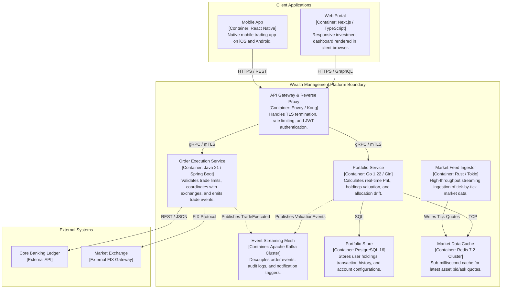

# C4 Level 2: Container Diagram

The **Container Diagram** zooms into the software system, showing the high-level deployable units (containers) that execute code or store data, alongside the protocols connecting them.

> *Note: In C4, a "Container" is NOT just a Docker container—it is any deployable runtime unit such as a Single-Page Application, mobile app, microservice API, serverless function, database, or message broker.*

## When to Use
- Solution Architecture Documents (SADs), High-Level Designs (HLDs), and team architectural alignment.
- Deciding technological choices (frameworks, databases, communication protocols).
- Reviewing system resilience, operational boundaries, and security perimeters.

---

## Architecture Example: Global Wealth Management Containers

---

## Related References
- [Container Template](./container-template.md)
- [Level 3 Component Diagram](./component.md)
- [C4 Deployment Topology](./deployment.md)
