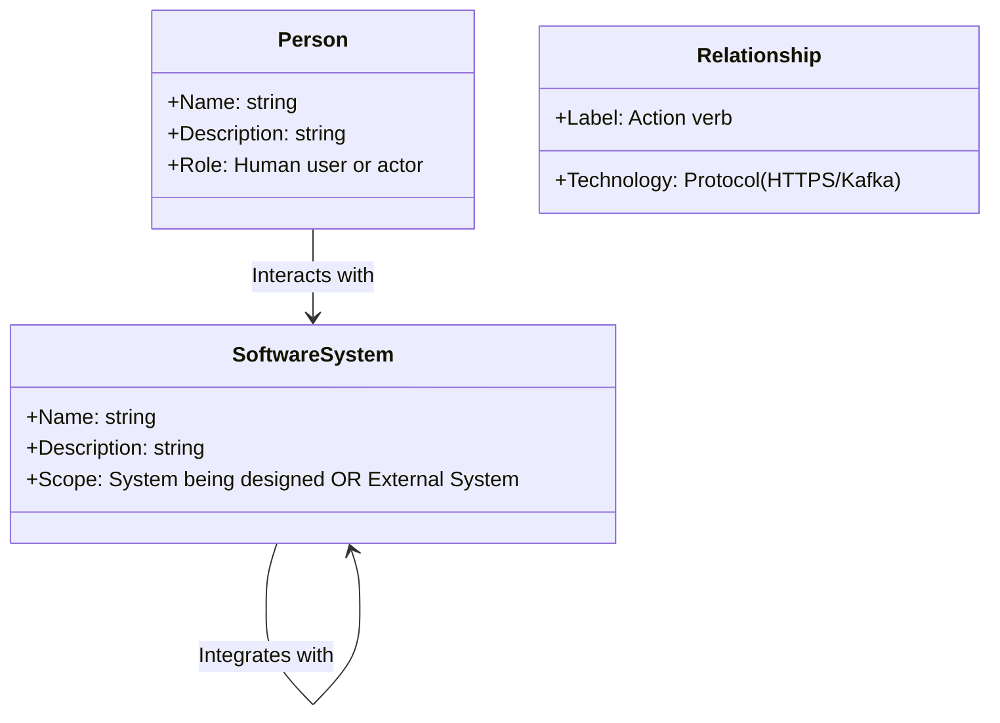

# C4 Model: Level 1 — System Context Diagram

## Overview

A **System Context Diagram (Level 1)** provides a high-level, 10,000-foot view of a software system. It establishes the system's external perimeter, illustrating the human actors (users, administrators, operators) who interact with it and the external enterprise or third-party systems it depends upon or integrates with.

This diagram is technology-agnostic. It avoids mentioning programming languages, databases, or cloud infrastructure, making it the ideal architectural artifact for communicating with executive leadership, business owners, and non-technical stakeholders.

---

## Architectural Elements of Level 1



1. **Person**: A human actor who uses the system (e.g., `Retail Customer`, `Fraud Investigator`).
2. **Software System (In Scope)**: The central software system being designed or evaluated.
3. **Software System (External / Out of Scope)**: Third-party systems, SaaS platforms, or other enterprise internal systems outside the architect's direct operational control (e.g., `Stripe Payment Gateway`, `Corporate SAP ERP`).
4. **Relationship**: Directed line describing how actors and systems interact, including the business intent and high-level protocol.

---

## Production Enterprise Example: Internet Banking System

```mermaid
graph TD
    Customer["Personal Banking Customer<br/>[Person]<br/>An existing retail customer of the bank with personal bank accounts."]
    
    BankSystem["Internet Banking System<br/>[Software System - IN SCOPE]<br/>Allows customers to view account balances, pay bills, and transfer funds securely."]
    
    CoreBanking["Mainframe Core Banking System<br/>[External Enterprise System]<br/>Stores core account balances, ledger entries, and handles clearing transactions."]
    
    EmailSystem["Third-Party Email Service (SendGrid)<br/>[External SaaS System]<br/>Delivers customer security alerts and account statements."]
    
    CreditBureau["Credit Rating Agency (Equifax)<br/>[External Partner System]<br/>Provides credit scores and identity verification lookups."]

    Customer -->|Views account balances and transfers funds using [HTTPS]| BankSystem
    BankSystem -->|Retrieves account balances and executes ledger writes using [SOAP/XML]| CoreBanking
    BankSystem -->|Sends verification tokens and transactional notifications using [REST/HTTPS]| EmailSystem
    BankSystem -->|Requests credit risk scores using [mTLS/REST]| CreditBureau
```

---

## Authoring Guidelines for Level 1

- **Focus on the Big Picture**: Do not include internal details like databases, microservices, or load balancers. The system under design must be shown as a single central box.
- **Explicit Relationships**: Avoid generic labels like `"uses"` or `"calls"`. Use descriptive phrases like `"Submits loan applications via [HTTPS]"` or `"Pushes batch clearing files via [SFTP]"`.
- **Stakeholder Accessibility**: Ensure that any business analyst, product manager, or enterprise executive can read and understand the entire diagram without technical translation.
