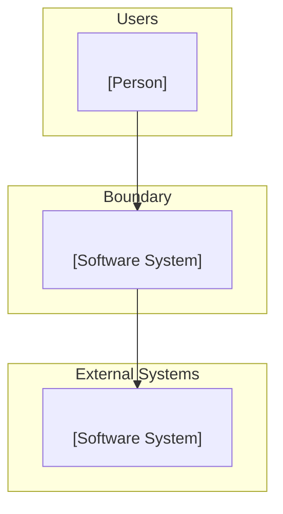
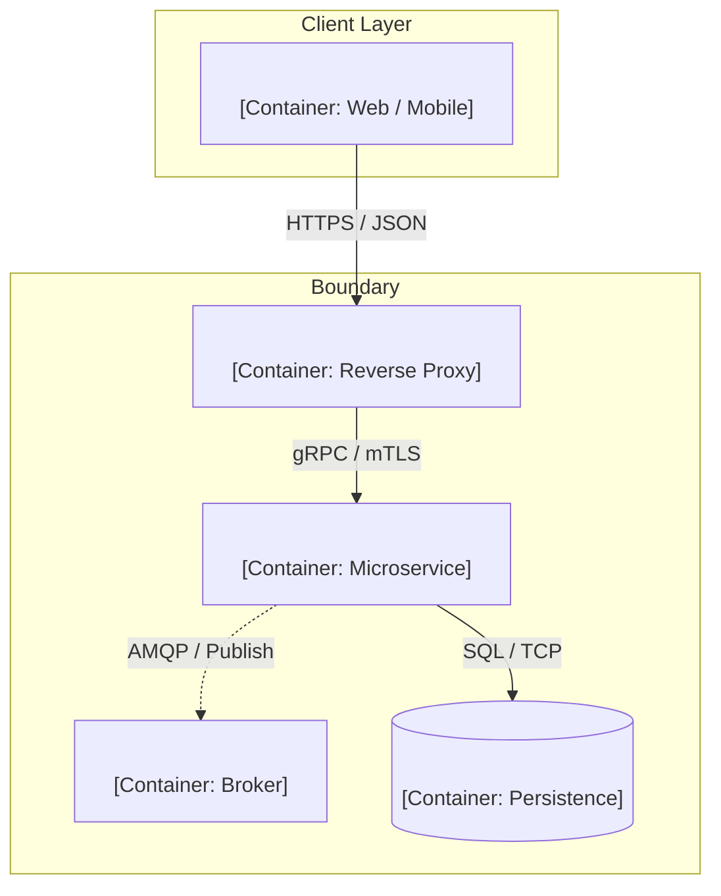
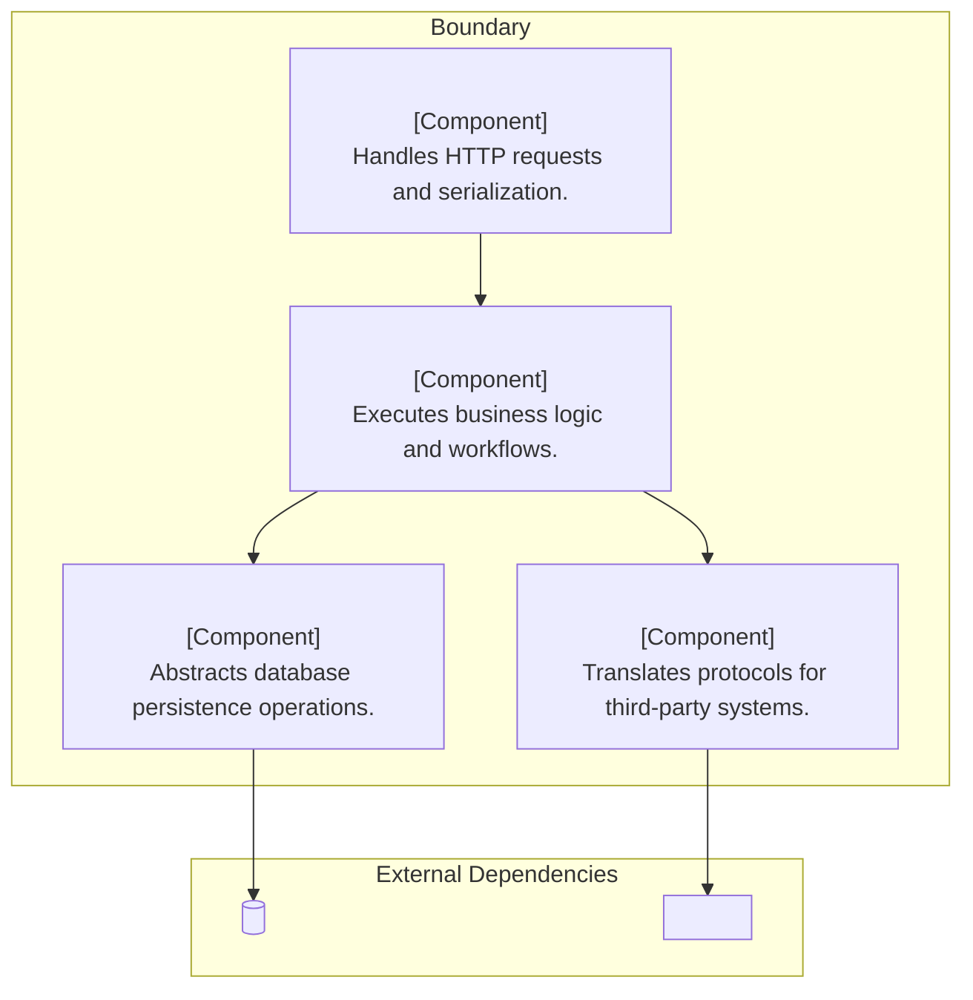

# C4 Architecture Templates

Minimal, copy-pasteable starter templates in Mermaid and PlantUML.

---

## 1. C4 Context Template (Mermaid)

---

## 2. C4 Container Template (Mermaid)

---

## 3. C4 Component Template (Mermaid)

