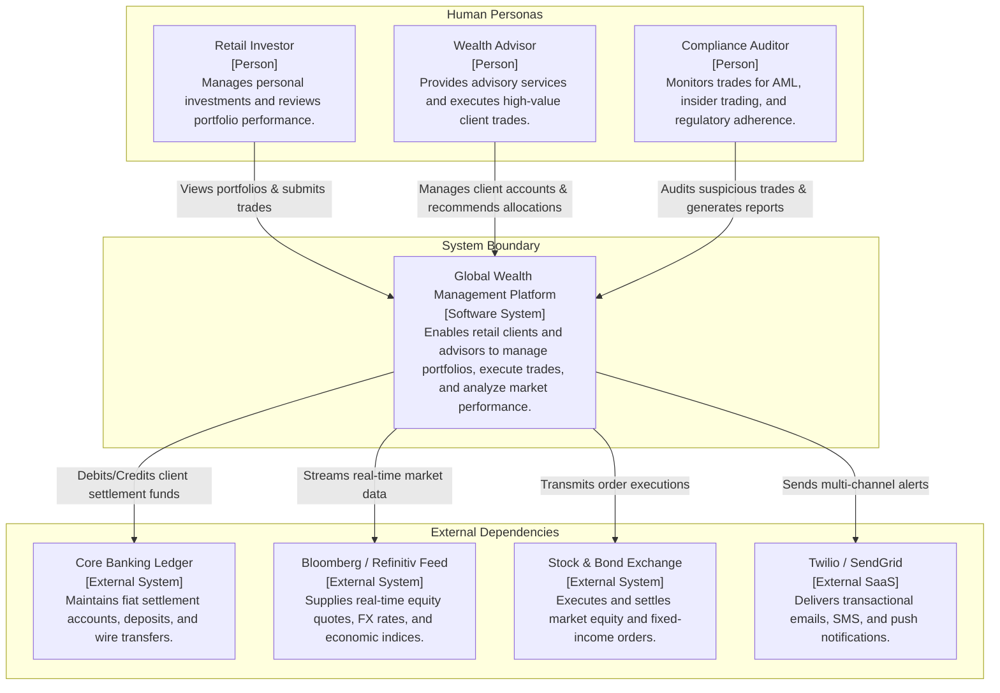

# C4 Level 1: System Context Diagram

The **System Context Diagram** establishes the boundary between the software system under design and the rest of the world. It shows the system in its environment, identifying human users and external software systems with which it interacts.

## When to Use
- Executive briefings, business stakeholder alignment, and Architecture Review Board (ARB) kickoffs.
- Defining project scope and identifying third-party vendor integrations.
- Onboarding new engineering personnel to the high-level operational domain.

## When NOT to Use
- Detailed technical design sessions, debugging discussions, or infrastructure provisioning.
- Do NOT include internal databases, ports, protocols, cloud services, or code details.

---

## Architecture Example: Global Wealth Management System

---

## Related References
- [Context Template](./context-template.md)
- [Level 2 Container Diagram](./container.md)
- [Diagram Selection Guide](../diagram-selection-guide.md)
