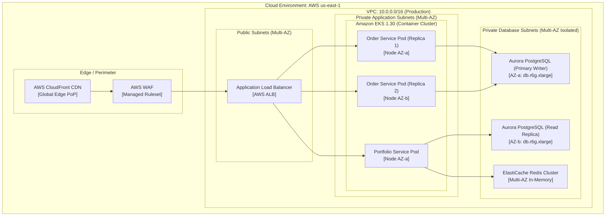

# C4 Deployment Diagram

The **C4 Deployment Diagram** maps software containers onto physical infrastructure, cloud compute nodes, network subnets, and availability zones.

```mermaid
flowchart TD
    subgraph AWSCloud["Cloud Environment: AWS us-east-1"]
        subgraph EdgeLayer["Edge / Perimeter"]
            CloudFront["AWS CloudFront CDN
[Global Edge PoP]"]
            WAF["AWS WAF
[Managed Ruleset]"]
        end

        subgraph ProductionVPC["VPC: 10.0.0.0/16 (Production)"]
            subgraph PublicSubnets["Public Subnets (Multi-AZ)"]
                ALB["Application Load Balancer
[AWS ALB]"]
            end

            subgraph PrivateAppSubnets["Private Application Subnets (Multi-AZ)"]
                subgraph EKSCluster["Amazon EKS 1.30 (Container Cluster)"]
                    Pod1["Order Service Pod (Replica 1)
[Node AZ-a]"]
                    Pod2["Order Service Pod (Replica 2)
[Node AZ-b]"]
                    Pod3["Portfolio Service Pod
[Node AZ-a]"]
                end
            end

            subgraph PrivateDataSubnets["Private Database Subnets (Multi-AZ Isolated)"]
                AuroraPrimary["Aurora PostgreSQL (Primary Writer)
[AZ-a: db.r6g.xlarge]"]
                AuroraReplica["Aurora PostgreSQL (Read Replica)
[AZ-b: db.r6g.xlarge]"]
                ElastiCache["ElastiCache Redis Cluster
[Multi-AZ In-Memory]"]
            end
        end
    end

    CloudFront --> WAF --> ALB
    ALB --> Pod1
    ALB --> Pod2
    ALB --> Pod3
    Pod1 --> AuroraPrimary
    Pod2 --> AuroraPrimary
    Pod3 --> AuroraReplica
    Pod3 --> ElastiCache
```
