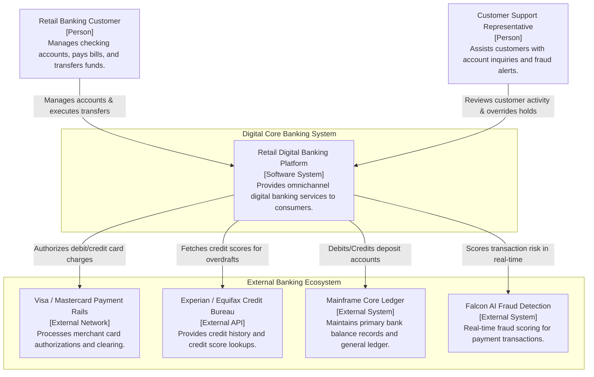
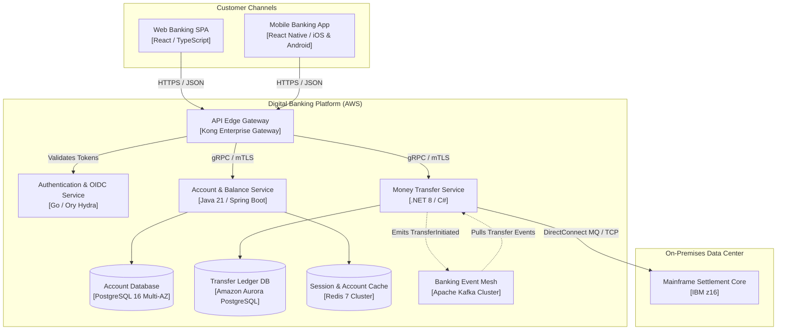

# C4 Comprehensive Enterprise Example: Retail Digital Banking

This document illustrates a complete end-to-end C4 model progression for a modern, multi-tier Digital Retail Banking Platform.

---

## Level 1: System Context

---

## Level 2: Container Topology

