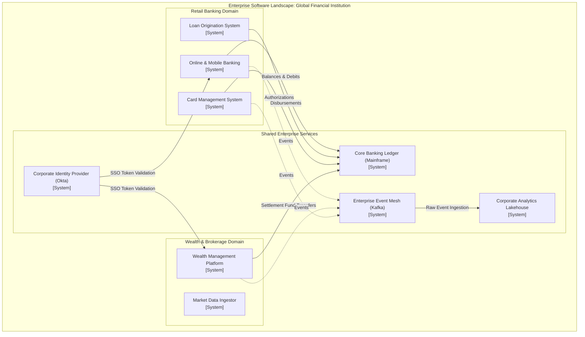

# C4 System Landscape Diagram

The **System Landscape Diagram** is an enterprise-level visualization showing all major software systems across the entire organization, identifying how value streams cut across organizational and technical boundaries.

