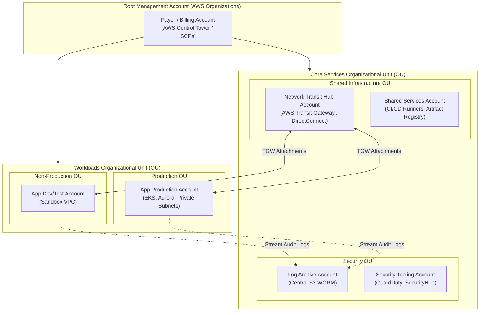
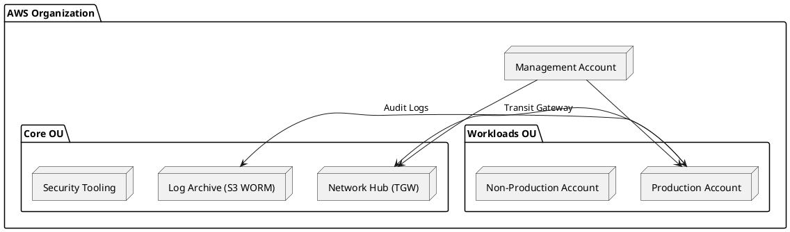

# AWS Multi-Account Organization & Well-Architected Topology

AWS Control Tower multi-account architecture aligning with the 6 Pillars of the AWS Well-Architected Framework across security, shared services, and workload accounts.

## Mermaid Architecture Diagram

## PlantUML Specification

## Architectural Design Considerations

* **Service Control Policies (SCPs)**: Attach guardrails at the Root and OU levels to disable root user logins, prevent disabling of GuardDuty, and restrict unauthorized AWS regions.
* **Network Isolation**: Workload accounts contain zero internet gateways; all ingress and egress traffic traverses the central Network Hub account via AWS Transit Gateway.
* **Least Privilege Workload Accounts**: Developers have zero console access to Production accounts; releases occur exclusively via automated CI/CD pipelines.

## Related Documentation & Patterns

* [Azure Enterprise Landing Zone](file:///d:/company/products/enterprise-architecture-handbook/17-diagrams/cloud/azure-enterprise-landing-zone.md)
* [GCP Enterprise Foundations](file:///d:/company/products/enterprise-architecture-handbook/17-diagrams/cloud/gcp-enterprise-foundations.md)
* [Network: Transit Gateway](file:///d:/company/products/enterprise-architecture-handbook/17-diagrams/network/transit-network.md)
