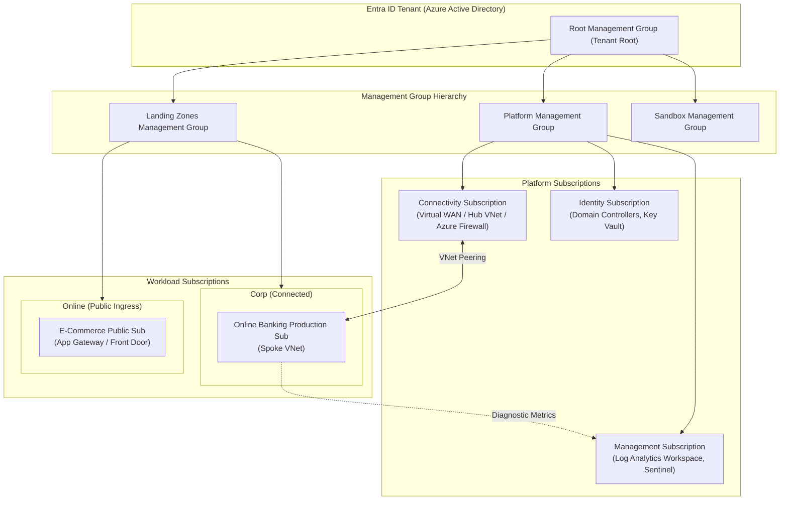
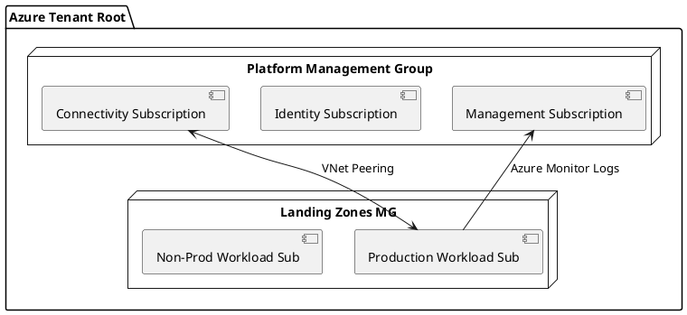

# Azure Enterprise Landing Zone (CAF Management Group Hierarchy)

Microsoft Cloud Adoption Framework (CAF) enterprise-scale landing zone detailing Management Groups, Subscriptions, Azure Policy, and Hub-Spoke virtual networks.

## Mermaid Architecture Diagram

## PlantUML Specification

## Architectural Design Considerations

* **Management Group Inheritance**: Azure Policies and RBAC assignments configured at higher Management Groups automatically inherit downward across all child subscriptions.
* **Dedicated Platform Subscriptions**: Segregate network routing (Connectivity), centralized logging (Management), and authentication (Identity) into separate subscriptions to prevent noisy-neighbor quota exhaustion.
* **Hub-and-Spoke Connectivity**: Force all inter-subscription communication through the Hub VNet's Azure Firewall for inspection and micro-segmentation.

## Related Documentation & Patterns

* [AWS Well-Architected](file:///d:/company/products/enterprise-architecture-handbook/17-diagrams/cloud/aws-well-architected.md)
* [GCP Enterprise Foundations](file:///d:/company/products/enterprise-architecture-handbook/17-diagrams/cloud/gcp-enterprise-foundations.md)
* [Network: Hub and Spoke](file:///d:/company/products/enterprise-architecture-handbook/17-diagrams/network/hub-spoke.md)
