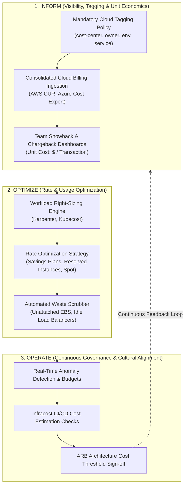
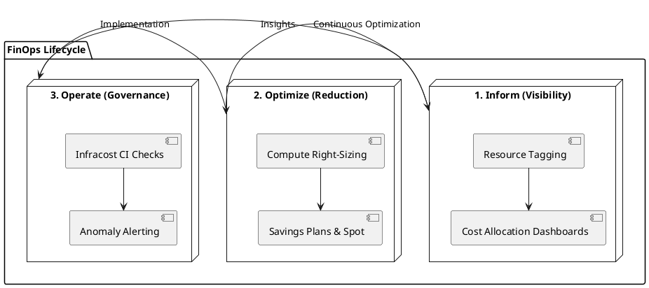

# FinOps Cloud Cost Governance & Optimization Lifecycle

FinOps Foundation architectural lifecycle: Inform (Visibility & Allocation), Optimize (Rate & Usage Reduction), and Operate (Continuous Continuous Alignment).

## Mermaid Architecture Diagram

## PlantUML Specification

## Architectural Design Considerations

* **Unit Economics**: Shift focus from raw aggregate cloud spend to unit metrics (e.g., cost per checkout, cost per API call) to measure financial efficiency during business growth.
* **Shift-Left Cost Estimation**: Run Infracost directly inside pull request CI workflows to show engineers the financial impact of Terraform changes before merging.
* **Commitment Coverage**: Maintain 70-80% coverage on baseline steady-state compute with 1-year or 3-year Compute Savings Plans, leaving spikes to on-demand or Spot.

## Related Documentation & Patterns

* [AWS Well-Architected](file:///d:/company/products/enterprise-architecture-handbook/17-diagrams/cloud/aws-well-architected.md)
* [Cloud Architecture Review Checklist](file:///d:/company/products/enterprise-architecture-handbook/17-diagrams/cloud/checklists.md)
* [Architecture: Trade-off Matrix](file:///d:/company/products/enterprise-architecture-handbook/17-diagrams/architecture/tradeoff-matrix.md)
