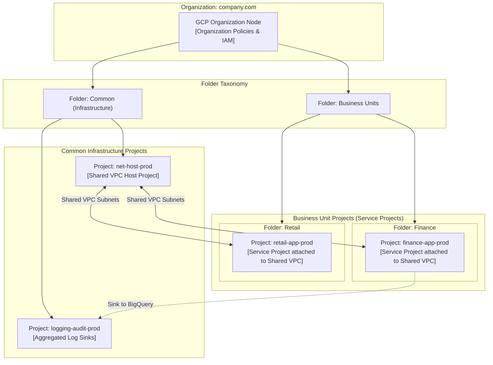
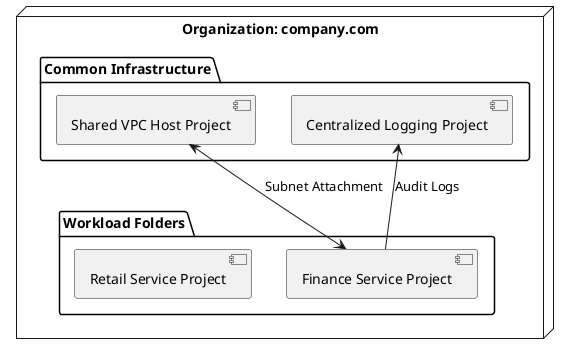

# Google Cloud Platform (GCP) Enterprise Foundation Architecture

GCP enterprise resource hierarchy detailing Organization resource, Folder taxonomy, Projects, Shared VPC, and Cloud Interconnect.

## Mermaid Architecture Diagram

## PlantUML Specification

## Architectural Design Considerations

* **Shared VPC Model**: Maintain centralized control over IP addressing, firewall rules, and routes in the host project while delegating application administration to service projects.
* **Organization Policies**: Enforce constraints such as `constraints/compute.skipDefaultVpcCreation` and `constraints/gcp.resourceLocations` across the entire enterprise hierarchy.
* **IAM Least Privilege**: Never grant project-wide primitive roles (`Owner`, `Editor`) in production environments; enforce granular predefined or custom roles.

## Related Documentation & Patterns

* [AWS Well-Architected](file:///d:/company/products/enterprise-architecture-handbook/17-diagrams/cloud/aws-well-architected.md)
* [Azure Enterprise Landing Zone](file:///d:/company/products/enterprise-architecture-handbook/17-diagrams/cloud/azure-enterprise-landing-zone.md)
* [Multi-Cloud Topology](file:///d:/company/products/enterprise-architecture-handbook/17-diagrams/cloud/multi-cloud.md)
