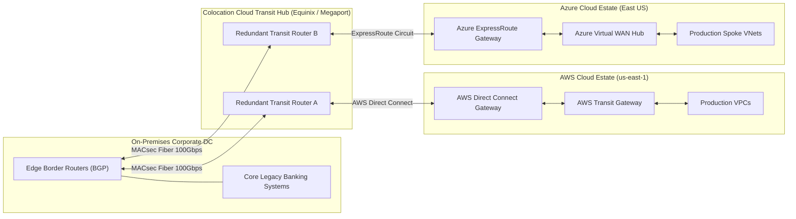
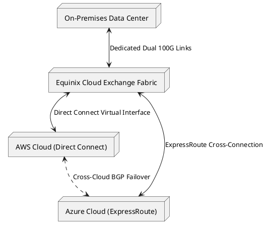

# Multi-Cloud & Hybrid Enterprise Topology

High-resilience enterprise architecture interconnecting on-premises private data centers, AWS, and Azure via redundant colocation transit centers (Equinix / Megaport).

## Mermaid Architecture Diagram

## PlantUML Specification

## Architectural Design Considerations

* **BGP Dynamic Routing**: Deploy redundant BGP peering across carrier exchange hubs with autonomous system (AS) path prepending to guarantee deterministic failover paths.
* **Data Egress Cost Awareness**: Minimize high-volume inter-cloud data transfer; locate interdependent data processing pipelines within the same cloud provider where possible.
* **Unified Security Policy**: Standardize Kubernetes (EKS/AKS) and infrastructure-as-code (Terraform) across clouds to avoid duplicate engineering skill requirements.

## Related Documentation & Patterns

* [AWS Well-Architected](file:///d:/company/products/enterprise-architecture-handbook/17-diagrams/cloud/aws-well-architected.md)
* [Azure Enterprise Landing Zone](file:///d:/company/products/enterprise-architecture-handbook/17-diagrams/cloud/azure-enterprise-landing-zone.md)
* [Network: DirectConnect](file:///d:/company/products/enterprise-architecture-handbook/17-diagrams/network/hybrid-connectivity.md)
