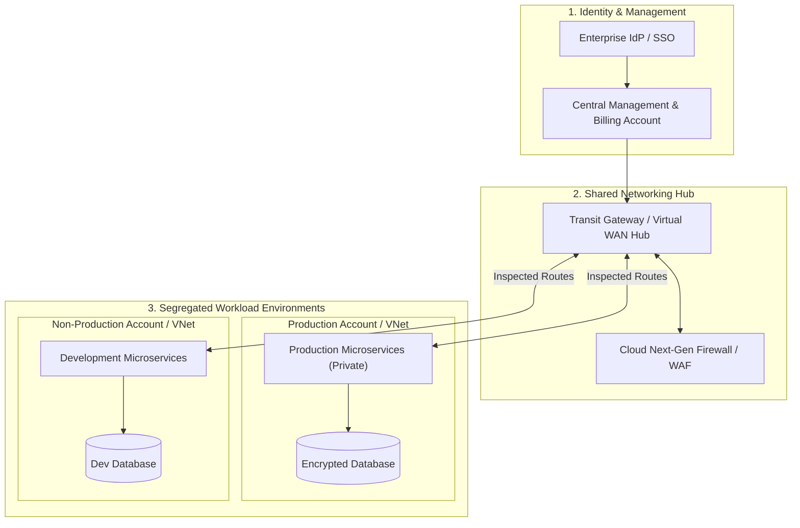
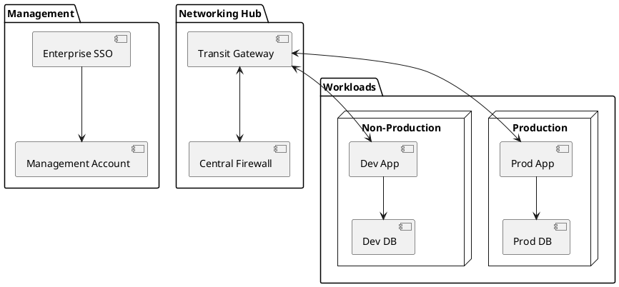

# Cloud Architecture Blueprint Starter Template

Standardized enterprise cloud landing zone template covering management accounts, shared networking hubs, and segregated workload environments.

## Mermaid Architecture Diagram

## PlantUML Specification

## Architectural Design Considerations

* **Standard Starter**: Copy and adapt this template when designing multi-account or multi-subscription cloud architectures.
* **Network Isolation**: Ensure production and non-production accounts are strictly isolated at the routing and policy layer.
* **Security Guardrails**: Mandate encryption and logging guardrails across all child accounts.

## Related Documentation & Patterns

* [AWS Well-Architected](file:///d:/company/products/enterprise-architecture-handbook/17-diagrams/cloud/aws-well-architected.md)
* [Azure Enterprise Landing Zone](file:///d:/company/products/enterprise-architecture-handbook/17-diagrams/cloud/azure-enterprise-landing-zone.md)
* [Cloud Architecture Checklist](file:///d:/company/products/enterprise-architecture-handbook/17-diagrams/cloud/checklists.md)
