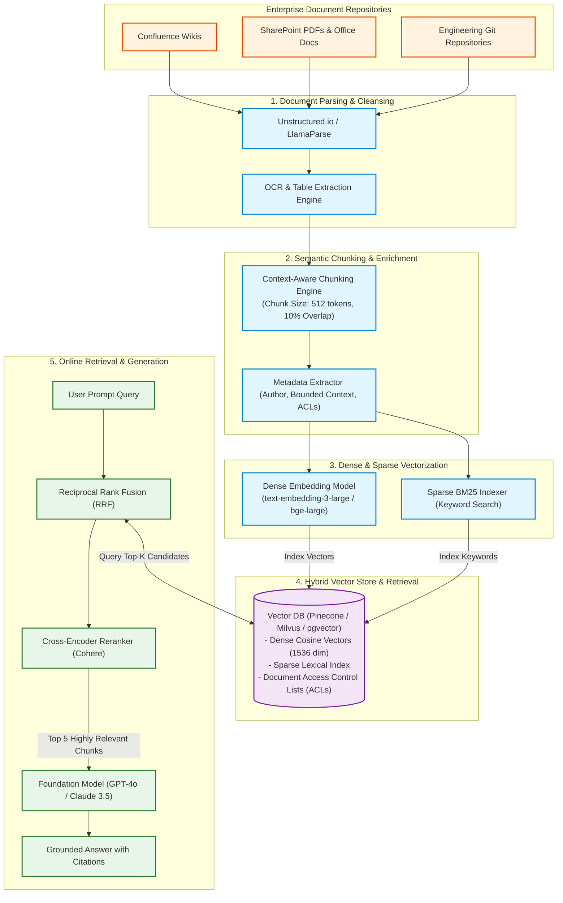

# AI / Retrieval-Augmented Generation (RAG) Data Ingestion Pipeline

End-to-end multi-stage data processing pipeline for generative AI: document extraction, semantic chunking, dense vector embedding, and hybrid search indexing.

## Mermaid Architecture Diagram

## PlantUML Specification

```plantuml
@startuml
package "Document Sources" {
  [PDFs & Wikis]
}
package "Ingestion Pipeline" {
  component "Parser & Table Extractor" as parse
  component "Semantic Chunker (512 tokens)" as chunk
  component "Embedding Model" as embed
}
package "Vector Store" {
  database "Vector DB (pgvector / Pinecone)" as vdb
}
package "Runtime Retrieval" {
  actor User
  component "Hybrid Search & Reranker" as search
  component "LLM Generation" as llm
}

[PDFs & Wikis] -> parse : Extract Text
parse -> chunk : Split into Semantically Meaningful Chunks
chunk -> embed : Generate Dense Float32 Vectors
embed -> vdb : Upsert Vector + ACL Metadata
User -> search : Query Text
search <-> vdb : Cosine Distance + Metadata Filter
search -> llm : Augment Prompt with Grounded Facts
llm -> User : Factually Grounded Response
@enduml
```

## Architectural Design Considerations

* **Hybrid Search Strategy**: Combine dense semantic embeddings (cosine similarity) with sparse keyword matching (BM25) via Reciprocal Rank Fusion to maximize recall.
* **Document-Level Security ACLs**: Embed user access group tags directly in vector metadata to enforce enterprise authorization at query time.
* **Cross-Encoder Reranking**: Run candidate chunks retrieved from the vector index through a secondary cross-encoder reranker model before constructing the LLM prompt.

## Related Documentation & Patterns

* [AI Security](file:///d:/company/products/enterprise-architecture-handbook/17-diagrams/security/ai-security.md)
* [Data Lakehouse](file:///d:/company/products/enterprise-architecture-handbook/17-diagrams/data-flow/lakehouse.md)
* [Physical Data Flow](file:///d:/company/products/enterprise-architecture-handbook/17-diagrams/data-flow/physical-data-flow.md)
