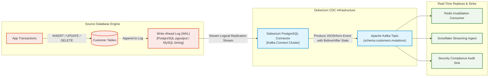
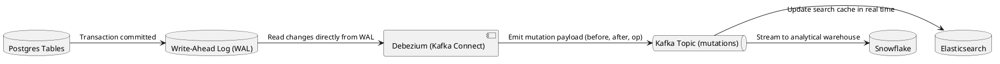

# Change Data Capture (CDC) Architecture (Debezium & Kafka Connect)

Non-intrusive log-based CDC architecture capturing row-level database mutations directly from the database write-ahead log (WAL) without querying source tables.

## Mermaid Architecture Diagram

## PlantUML Specification

## Architectural Design Considerations

* **Zero Database Impact**: Reading from transaction logs avoids executing expensive `SELECT ... WHERE updated_at > ?` polling queries against active production databases.
* **Payload Richness**: Debezium captures full operational metadata: operation type (`c`, `u`, `d`), transaction timestamp, and both `before` and `after` row states.
* **Schema Evolution**: Integrate with Schema Registry to automatically detect and handle upstream column additions or type migrations without crashing consumers.

## Related Documentation & Patterns

* [Event-Driven Data Flow](file:///d:/company/products/enterprise-architecture-handbook/17-diagrams/data-flow/event-driven.md)
* [Streaming Architecture](file:///d:/company/products/enterprise-architecture-handbook/17-diagrams/data-flow/streaming.md)
* [Data Migration](file:///d:/company/products/enterprise-architecture-handbook/17-diagrams/data-flow/data-migration.md)
