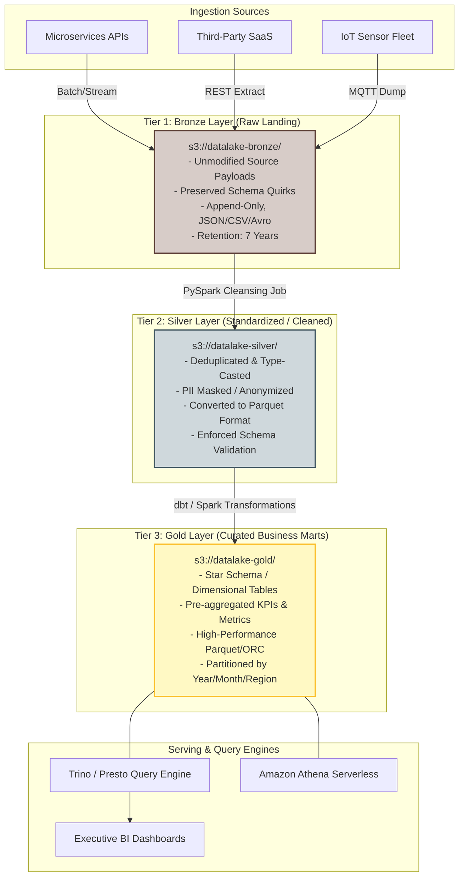
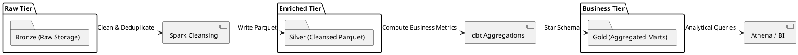

# Multi-Tier Data Lake Architecture (Bronze, Silver, Gold)

Hierarchical data lake storage pattern organizing raw landing assets into cleansed intermediate representations and aggregated business-ready data assets.

## Mermaid Architecture Diagram

## PlantUML Specification

## Architectural Design Considerations

* **Immutability of Bronze**: Never modify raw data in the Bronze layer; it serves as the ultimate system of record for replaying transformations.
* **Columnar Storage**: Ensure Silver and Gold layers are stored in columnar formats (Apache Parquet or ORC) with Snappy compression for optimal query performance.
* **Partitioning Strategy**: Partition data by query-predicate dimensions (e.g., `date=YYYY-MM-DD`, `tenant_id=XYZ`) to prune unneeded files during scans.

## Related Documentation & Patterns

* [Modern Lakehouse](file:///d:/company/products/enterprise-architecture-handbook/17-diagrams/data-flow/lakehouse.md)
* [Data Warehouse](file:///d:/company/products/enterprise-architecture-handbook/17-diagrams/data-flow/data-warehouse.md)
* [Batch ETL](file:///d:/company/products/enterprise-architecture-handbook/17-diagrams/data-flow/etl.md)
