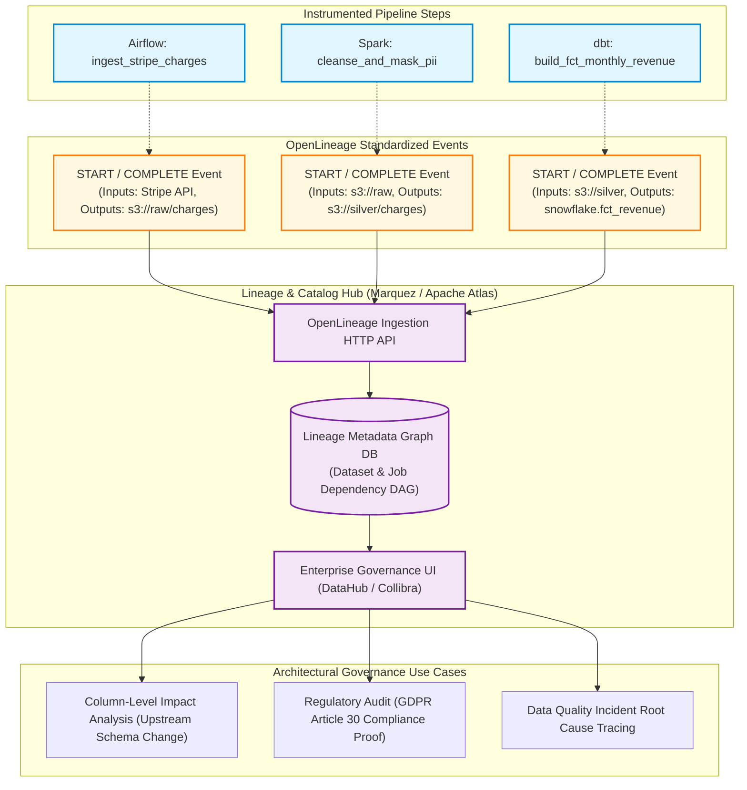
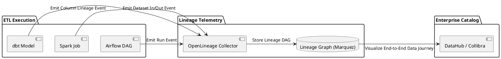

# Data Lineage & Column-Level Governance Architecture

OpenLineage metadata tracing architecture capturing complete end-to-end data provenance from raw ingestion to column-level analytical outputs.

## Mermaid Architecture Diagram

## PlantUML Specification

## Architectural Design Considerations

* **Standardized Metadata**: Adopt the OpenLineage open standard to ensure lineage instrumentation is portable across Airflow, Spark, dbt, and Flink.
* **Column-Level Lineage**: Capture precise column transformations (e.g., `revenue = price * quantity - discount`) to allow comprehensive impact analysis before altering upstream tables.
* **Automated Failure Alerting**: Automatically notify downstream data consumers whenever upstream ingestion pipelines fail or experience significant schema drift.

## Related Documentation & Patterns

* [Modern ELT](file:///d:/company/products/enterprise-architecture-handbook/17-diagrams/data-flow/elt.md)
* [PII Data Flow](file:///d:/company/products/enterprise-architecture-handbook/17-diagrams/data-flow/pii-flow.md)
* [Data Review Checklist](file:///d:/company/products/enterprise-architecture-handbook/17-diagrams/data-flow/checklists.md)
