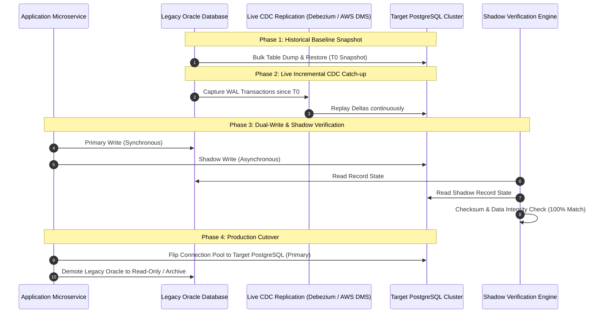

# Zero-Downtime Database Migration Architecture

Live database migration topology incorporating bulk initial snapshotting, CDC delta catch-up, dual-writing, automated shadow verification, and cutover.

## Mermaid Architecture Diagram



## PlantUML Specification

```plantuml
@startuml
autonumber
participant "App Service" as app
database "Legacy Database (Source)" as oldDB
component "CDC Replication" as cdc
database "Cloud Database (Target)" as newDB
component "Reconciliation Engine" as audit

oldDB -> newDB : 1. Baseline Bulk Snapshot Export
oldDB -> cdc : 2. Stream Log Mutations
cdc -> newDB : 3. Apply Deltas Continuously
app -> oldDB : 4. Active Production Traffic
app -> newDB : 5. Shadow Dual-Write
audit -> oldDB : 6. Read Checksum
audit -> newDB : 6. Read Checksum & Validate Equality
app -> newDB : 7. Promote Target to Primary (Zero Downtime)
@enduml
```

## Architectural Design Considerations

* **Zero Downtime Constraint**: Use log-based CDC replication to sync changes made to the legacy system while initial bulk data transfer is taking place.
* **Automated Reconciliation**: Continuously run background checksum verifiers across source and target tables before initiating DNS/application cutover.
* **Reversible Cutover (Fallback)**: Maintain reverse CDC replication from target back to source for 48 hours post-cutover to allow instant rollback if critical defects emerge.

## Related Documentation & Patterns

* [Change Data Capture](file:///d:/company/products/enterprise-architecture-handbook/17-diagrams/data-flow/cdc.md)
* [Data Synchronization](file:///d:/company/products/enterprise-architecture-handbook/17-diagrams/data-flow/data-synchronization.md)
* [Deployment: Kubernetes](file:///d:/company/products/enterprise-architecture-handbook/17-diagrams/deployment/kubernetes.md)
