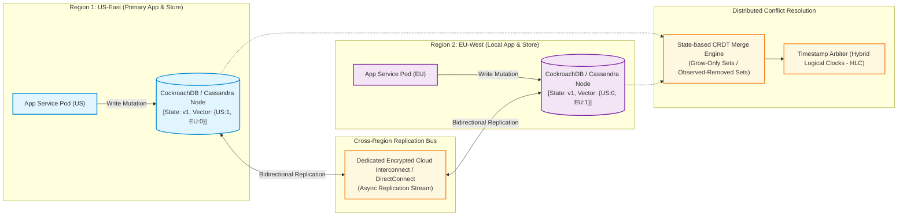
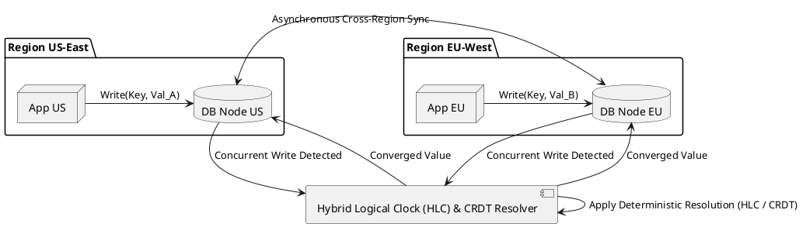

# Multi-Region Data Synchronization & Conflict Resolution

Active-Active geo-replicated data synchronization architecture detailing Conflict-Free Replicated Data Types (CRDTs), Last-Write-Wins (LWW), and vector clocks.

## Mermaid Architecture Diagram

## PlantUML Specification

## Architectural Design Considerations

* **Hybrid Logical Clocks (HLC)**: Avoid pure physical NTP clocks for ordering distributed events; use HLCs to guarantee causality without clock skew anomalies.
* **Conflict-Free Data Types (CRDTs)**: For additive or counter metrics (e.g., shopping cart items, view counts), use CRDTs to achieve mathematically guaranteed convergence without data loss.
* **Data Sovereignty Compliance**: Ensure synchronization filters strictly exclude EU GDPR-protected fields from replicating across foreign border regions.

## Related Documentation & Patterns

* [Data Migration](file:///d:/company/products/enterprise-architecture-handbook/17-diagrams/data-flow/data-migration.md)
* [Physical Data Flow](file:///d:/company/products/enterprise-architecture-handbook/17-diagrams/data-flow/physical-data-flow.md)
* [PII Data Flow](file:///d:/company/products/enterprise-architecture-handbook/17-diagrams/data-flow/pii-flow.md)
