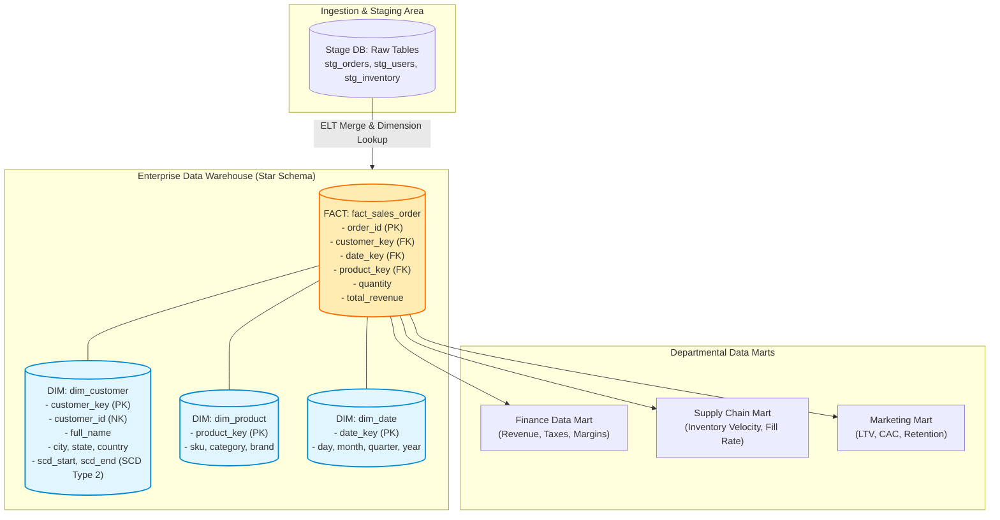
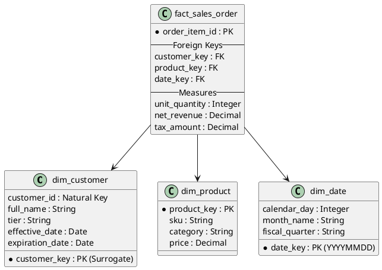

# Enterprise Data Warehouse (EDW) Architecture & Dimensional Modeling

Classic Kimball dimensional modeling architecture detailing Star Schemas, Conformed Dimensions, Fact Tables, and Data Mart presentation layers.

## Mermaid Architecture Diagram

## PlantUML Specification

## Architectural Design Considerations

* **Surrogate Keys**: Always generate integer surrogate keys for dimensions to decouple warehouse history from operational source database natural keys.
* **Slowly Changing Dimensions (SCD)**: Implement SCD Type 2 (with `start_date`, `end_date`, and `is_current` flags) to preserve complete historical fidelity.
* **Conformed Dimensions**: Ensure shared dimensions (Customer, Product, Date) are standardized across the enterprise to enable cross-departmental drill-downs.

## Related Documentation & Patterns

* [Data Lake](file:///d:/company/products/enterprise-architecture-handbook/17-diagrams/data-flow/data-lake.md)
* [Modern Lakehouse](file:///d:/company/products/enterprise-architecture-handbook/17-diagrams/data-flow/lakehouse.md)
* [Batch ETL](file:///d:/company/products/enterprise-architecture-handbook/17-diagrams/data-flow/etl.md)
