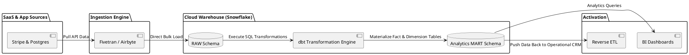

# Modern Cloud ELT (Extract-Load-Transform) Pipeline with dbt

Cloud-native ELT pipeline leveraging raw cloud storage loading, automated schema evolution, and in-warehouse transformation modeling with dbt and SQL.

## Mermaid Architecture Diagram

```mermaid
graph LR
    subgraph IngestionExtractors ["Extraction & Ingestion"]
        Stripe["Stripe Billing API"]
        Postgres["Production DB (CDC)"]
        Hubspot["HubSpot Marketing"]
        Fivetran["EL Tool (Fivetran / Airbyte)"]

        Stripe --> Fivetran
        Postgres --> Fivetran
        Hubspot --> Fivetran
    end

    subgraph CloudWarehouse ["Cloud Data Warehouse (Snowflake / BigQuery)"]
        subgraph RawSchema ["1. RAW Layer (Untransformed Load)"]
            RawTables[("raw_stripe_charges<br/>raw_postgres_users<br/>raw_hubspot_contacts")]
        end

        subgraph StagingDbt ["2. dbt Staging Models (Cleanse & Cast)"]
            StgModels["stg_payments<br/>stg_customers"]
        end

        subgraph MartsDbt ["3. dbt Marts (Business Dimensions & Facts)"]
            Marts["fct_mrr_subscriptions<br/>dim_customers"]
        end

        Fivetran -->|"Direct Automated Load<br/>(Zero Transformation)"| RawTables
        RawTables -->|"dbt run (SQL Transforms)"| StgModels
        StgModels -->|"dbt build + tests"| Marts
    end

    subgraph ConsumptionTier ["Consumption & Activation"]
        Looker["Looker / Metabase"]
        Census["Reverse ETL (Census / Hightouch)"]
        Salesforce["Salesforce CRM"]

        Marts --> Looker
        Marts --> Census
        Census -->|"Sync Enriched Customer Scores"| Salesforce
    end

    classDef el fill:#fff3e0,stroke:#e65100,stroke-width:2px;
    classDef wh fill:#e1f5fe,stroke:#0288d1,stroke-width:2px;
    classDef rev fill:#f3e5f5,stroke:#4a148c,stroke-width:2px;
    class Stripe,Postgres,Hubspot,Fivetran el;
    class RawTables,StgModels,Marts wh;
    class Looker,Census,Salesforce rev;
```

## PlantUML Specification

## Architectural Design Considerations

* **Separation of Compute and Storage**: Scale warehouse compute independently during heavy transformation runs without incurring ongoing idle costs.
* **dbt Version Control & Testing**: All transformations are modeled as SQL with automated schema and uniqueness tests executed before production promotion.
* **Reverse ETL Activation**: Data doesn't just sit in analytical dashboards; clean warehouse metrics are synced back into operational tools (Salesforce, Zendesk).

## Related Documentation & Patterns

* [Batch ETL](file:///d:/company/products/enterprise-architecture-handbook/17-diagrams/data-flow/etl.md)
* [Modern Lakehouse](file:///d:/company/products/enterprise-architecture-handbook/17-diagrams/data-flow/lakehouse.md)
* [Data Lineage](file:///d:/company/products/enterprise-architecture-handbook/17-diagrams/data-flow/data-lineage.md)
