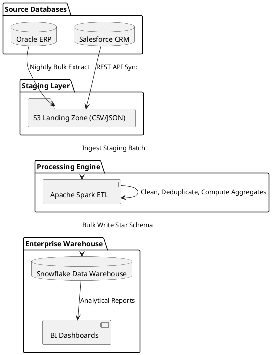

# Traditional Batch ETL (Extract-Transform-Load) Pipeline

Scheduled batch ETL architecture detailing transactional extraction, transformation staging clusters, deduplication, and loading into historical data warehouses.

## Mermaid Architecture Diagram

```mermaid
graph LR
    subgraph Sources ["Transactional Sources"]
        ERP[("ERP System<br/>(Oracle DB)")]
        CRM[("CRM System<br/>(Salesforce API)")]
        Logs[("Web Server Logs<br/>(Syslog/S3)")]
    end

    subgraph StagingZone ["Staging Area (Landing Zone)"]
        S3Raw["S3 Raw Staging Bucket<br/>[Immutable Gzip CSV/JSON]"]
        ERP -->|"Daily Batch Export (JDBC)"| S3Raw
        CRM -->|"Nightly REST Ingest"| S3Raw
        Logs -->|"Hourly Batch Sync"| S3Raw
    end

    subgraph TransformCompute ["Transformation Engine (Apache Spark / EMR)"]
        SparkJob["PySpark / Spark SQL Cluster"]
        S3Raw -->|"Read Batch Data"| SparkJob
        
        SparkJob --> Cleanse["Data Cleaning & Type Casting"]
        Cleanse --> Dedupe["Entity Deduplication & Matching"]
        Dedupe --> Enrich["Surrogate Key Generation & Star Schema"]
    end

    subgraph DataWarehouse ["Curated Warehouse & Serving"]
        DW[(Enterprise Data Warehouse<br/>[Snowflake / Redshift])]
        Enrich -->|"Bulk Copy / Merge Load"| DW
        BI["BI Reporting & Executive Dashboards<br/>[Tableau / PowerBI]"]
        DW --> BI
    end

    classDef src fill:#fbe9e7,stroke:#d84315,stroke-width:2px;
    classDef stg fill:#fff8e1,stroke:#f57f17,stroke-width:2px;
    classDef trn fill:#e1f5fe,stroke:#0288d1,stroke-width:2px;
    classDef dw fill:#e8f5e9,stroke:#2e7d32,stroke-width:2px;
    class ERP,CRM,Logs src;
    class S3Raw stg;
    class SparkJob,Cleanse,Dedupe,Enrich trn;
    class DW,BI dw;
```

## PlantUML Specification



## Architectural Design Considerations

* **Batch Window Sizing**: Design ETL pipeline throughput to finish comfortably within off-peak overnight maintenance windows (e.g., 01:00 to 05:00 UTC).
* **Idempotent Reprocessing**: Ensure ETL pipelines can be safely rerun for any historical date without creating duplicate dimension or fact records.
* **Checkpointing and Lineage**: Record pipeline run IDs, row counts, and checksum validations in an operational metadata repository for governance audit.

## Related Documentation & Patterns

* [Modern ELT](file:///d:/company/products/enterprise-architecture-handbook/17-diagrams/data-flow/elt.md)
* [Data Lake](file:///d:/company/products/enterprise-architecture-handbook/17-diagrams/data-flow/data-lake.md)
* [Data Warehouse](file:///d:/company/products/enterprise-architecture-handbook/17-diagrams/data-flow/data-warehouse.md)
