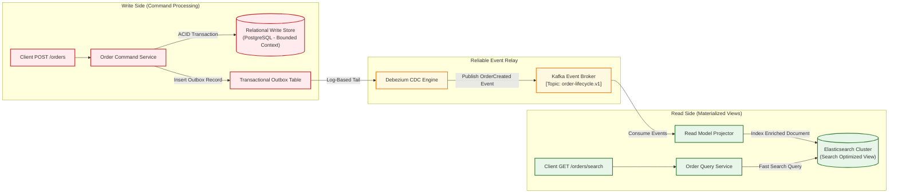
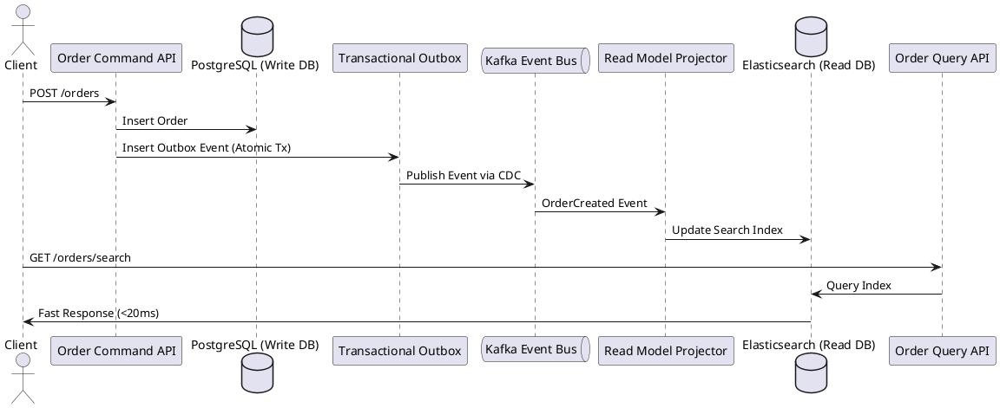

# Event-Driven Data Architecture & CQRS Pattern

Command Query Responsibility Segregation (CQRS) and event-driven data flow synchronizing write-side commands with read-optimized materialized views.

## Mermaid Architecture Diagram

## PlantUML Specification

## Architectural Design Considerations

* **Transactional Outbox Pattern**: Prevent dual-write anomalies by writing entity mutations and event messages within a single database transaction.
* **Eventual Consistency**: Acknowledge that the read model may lag slightly behind the write model (typically tens of milliseconds).
* **Consumer Idempotency**: Consumers must record processed message identifiers to safely discard duplicate events during rebalances.

## Related Documentation & Patterns

* [Change Data Capture](file:///d:/company/products/enterprise-architecture-handbook/17-diagrams/data-flow/cdc.md)
* [Streaming Architecture](file:///d:/company/products/enterprise-architecture-handbook/17-diagrams/data-flow/streaming.md)
* [Logical Data Flow](file:///d:/company/products/enterprise-architecture-handbook/17-diagrams/data-flow/logical-data-flow.md)
